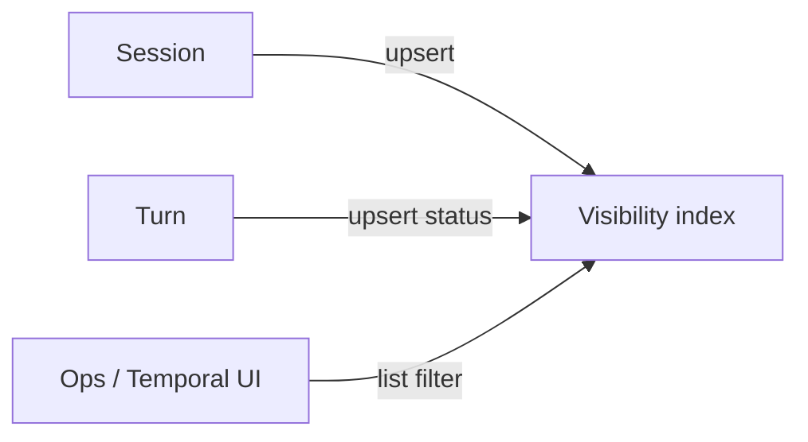

<h1>Session Visibility Attributes </h1>

## Overview

The Session Visibility Attributes pattern upserts bounded custom Search Attributes on Session and Turn boundaries so operators can list and filter agent work in Temporal Visibility without knowing Workflow Ids.
Primitives used: Custom Search Attributes, `upsert_search_attributes`, Session/Turn lifecycle, Identity keys, optional Fairness / schedule source tags.

## Problem

Support and on-call need "all Sessions awaiting approval for tenant X" or "scheduled Sessions stuck in `running`."
Workflow Ids alone force tribal knowledge or a separate index.
Free-form prompts as Search Attributes explode cardinality and leak data into Visibility.

## Solution

Define a small, typed attribute set at Namespace setup.
Upsert values when Session starts, Turn status changes, approvals park, schedules fire, or cancel/complete happens.
Keep product identity ([Identity](/identity)) mirrored into those attributes for joins.



The following describes each step in the diagram:

1. Session start writes `sessionId`, `agentId`, `tenantId`, `turnStatus`.
2. Turn and HITL transitions update `turnStatus` (and related flags).
3. Operators query Visibility (`WorkflowType` + attributes) without prior Workflow Id knowledge.

```python
from temporalio import workflow
from temporalio.common import SearchAttributeKey

TURN_STATUS = SearchAttributeKey.for_keyword("AgentTurnStatus")
TENANT_ID = SearchAttributeKey.for_keyword("AgentTenantId")

@workflow.defn
class AgentSessionWorkflow:
    @workflow.run
    async def run(self, session_id: str, tenant_id: str) -> str:
        workflow.upsert_search_attributes(
            [
                TURN_STATUS.value_set("running"),
                TENANT_ID.value_set(tenant_id),
            ]
        )
        # ... park for approval ...
        workflow.upsert_search_attributes([TURN_STATUS.value_set("awaiting_approval")])
        return "ok"
```

## Implementation

<DaytonaRunner pattern="session-visibility-attributes" />

### Recommended attributes

| Attribute | Type | Example values |
| :--- | :--- | :--- |
| `AgentSessionId` | Keyword | Session / Workflow Id mirror |
| `AgentId` | Keyword | Definition family (not every revision) |
| `AgentTenantId` | Keyword | Tenant / fairness key |
| `AgentTurnStatus` | Keyword | `idle` / `running` / `awaiting_approval` / `awaiting_user` / `cancelled` |
| `AgentSource` | Keyword | `interactive` / `schedule` |
| `AgentDefinitionRev` | Keyword | Optional short pin for incidents |

Register attributes on the Namespace before Workers run (`temporal operator search-attribute create …`).

### When to upsert

- Session start / Continue-As-New (re-apply current values)
- Turn start / end / cancel
- Approval or ask-user park and resume
- Budget exceeded / quarantine (if you add those patterns)
- Definition/binding migration events

### Cardinality rules

Index IDs and enums only.
Do not index prompts, tool args, transcripts, or per-token ids.
Put high-cardinality detail in the event stream or external store; link via `session_id`.

### Queries

Example list intent: Sessions for a tenant awaiting approval:

```text
WorkflowType = "AgentSessionWorkflow" AND AgentTenantId = "acme" AND AgentTurnStatus = "awaiting_approval"
```

Pair with [Agent Tracing](/agent-tracing) spans that carry the same keys.

## When to use

Use for any multi-tenant or multi-agent production fleet.
Skip only for single-developer demos with one Session Id you already know.

## Benefits and trade-offs

You get operable list/filter UX in Temporal UI and automation.
You must register attributes, keep enums tight, and avoid PII in Visibility.

## Comparison with alternatives

| Approach | Find by status | Cardinality risk |
| :--- | :--- | :--- |
| Session Visibility Attributes | Yes | Low if enums |
| Workflow Id only | No | Low |
| External DB mirror of every event | Yes | Ops cost |
| Indexing prompts | Yes | High / leaky |

## Best practices

- **Upsert on Continue-As-New**—new runs do not inherit prior custom attribute sets automatically in a way you should rely on; re-apply.
- **Keep Workflow state + Visibility in sync** on the same decision task as the status change.
- **Document the enum** for `AgentTurnStatus` across channels and HITL.
- **Authorize Visibility access** like any other ops surface.

## Common pitfalls

- **Never upserting after approval park**—ops cannot find stuck HITL.
- **High-cardinality attributes** (raw user text).
- **Using User Id as the only Session key** in Visibility when users have many Sessions.
- **Forgetting Namespace registration** so upserts fail at runtime.
- **Treating Visibility as the audit log**—use the event stream for history.

## Related patterns

- [Identity](/identity)
- [Session Workflow](/session-workflow)
- [Ask-User Wait](/ask-user-wait)
- [Approval-Gated Tools](/approval-gated-tools)
- [Cancel In-Flight Turn](/cancel-in-flight-turn)
- [Scheduled Agent Turns](/scheduled-agent-turns)
- [Fairness](/fairness)
- [Agent Tracing](/agent-tracing)
- [Standardized Event Stream](/standardized-event-stream)

## Sample code

- [`sandbox-runner/patterns/session-visibility-attributes/python/`](https://github.com/temporal-sa/temporal-agentic-patterns/tree/main/sandbox-runner/patterns/session-visibility-attributes/python)

## References

- [Temporal Docs: Search Attributes](https://docs.temporal.io/search-attribute)
- [Temporal Docs: Visibility](https://docs.temporal.io/visibility)
- [Temporal Docs: List Filters](https://docs.temporal.io/list-filter)
