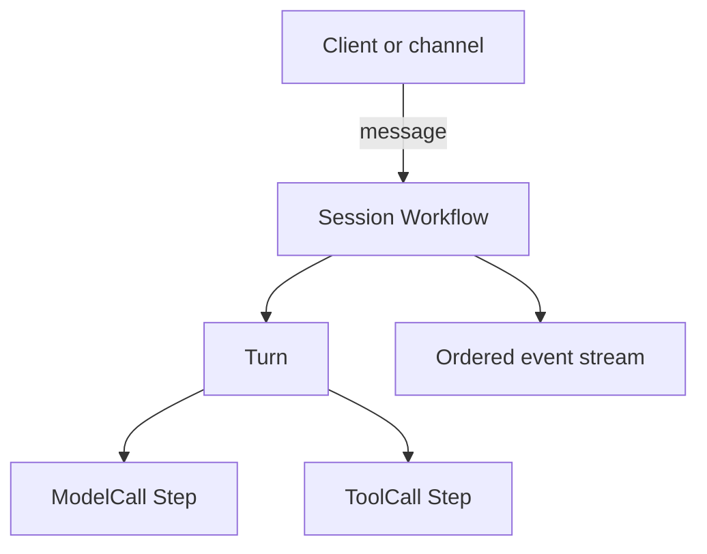

<h1>Session Workflow </h1>

## Overview

The Session Workflow pattern models an agent session as a single long-lived Temporal Workflow.
That Workflow owns cross-turn memory, approval state, and the ordered event stream, and it starts turns in response to inputs.
Primitives used: Session, Turn, Step, event stream (`session_started`, `turn_started`, `turn_ended`, `session_ended`).

## Problem

Chatbots and agent loops often keep conversation state in process memory or an external store that is not coordinated with tool execution.
When a worker restarts mid-turn, you lose progress, retry side effects blindly, or cannot reconstruct what the agent already did.
You need one durable address for the session that outlives individual model calls.

## Solution

Bind one `session_id` to one Workflow execution.
Each user or system message becomes a Turn inside that Session.
Model calls and tools run as Activities (Steps) so completed work replays from history after a restart.



The following describes each step in the diagram:

1. A client or channel addresses the Session by `session_id`.
2. The Session Workflow starts a Turn for the incoming message.
3. The Turn runs model and tool Steps as Activities with timeouts and retries.
4. The Session appends lifecycle events so observers can reconstruct the run without reading Temporal history directly.

```python
# workflows.py
from datetime import timedelta
from temporalio import workflow

with workflow.unsafe.imports_passed_through():
    from activities import call_model, run_tool

@workflow.defn
class AgentSessionWorkflow:
    @workflow.run
    async def run(self, session_id: str, user_message: str) -> str:
        events = [f"session_started:{session_id}", "turn_started"]
        reply = await workflow.execute_activity(
            call_model,
            user_message,
            start_to_close_timeout=timedelta(seconds=30),
        )
        events.append("model_call_completed")
        tool_result = await workflow.execute_activity(
            run_tool,
            args=["echo", reply],
            start_to_close_timeout=timedelta(seconds=30),
        )
        events.append(f"tool_call_completed:{tool_result}")
        events.append("turn_ended")
        events.append("session_ended")
        return " | ".join(events)
```

## Implementation

<DaytonaRunner pattern="session-workflow" />

The sample uses a stub model Activity so the run completes without an API key.
Production agents replace `call_model` with a real provider Activity and keep the same Session/Turn/Step boundaries.

### Owning session state

Keep memory summaries, approval overrides, and pending waits on the Session Workflow fields.
Pass only the next Turn input and any snapshot needed after Continue-As-New.

### Emitting events

Append structured events at session, turn, and step boundaries.
UIs and audits should prefer this stream over ad-hoc logs.

## When to use

Use a Session Workflow when a conversation or job must survive restarts, park for approvals, or expose a stable ID to channels.
It is not a good fit for a one-shot script that never waits and never retries.

## Benefits and trade-offs

You get crash safety, a single place for memory and approvals, and a reconstructable event stream.
You must manage Workflow history growth and design Continue-As-New for long sessions.

## Comparison with alternatives

| Approach | Durability | Stable ID | Event stream |
| :--- | :--- | :--- | :--- |
| Session Workflow | High | Yes | Natural fit |
| Stateless request handler | None | No | Manual |
| External DB only | Partial | Yes | Easy to drift from execution |

## Best practices

- **One Workflow per session_id.** Avoid racing two executions for the same session.
- **Activities for IO.** Keep the Workflow deterministic.
- **Emit events early.** Record `session_started` before the first model call.
- **Plan Continue-As-New.** Snapshot memory and approval state before history grows large.

## Common pitfalls

- **Storing huge transcripts in Workflow arguments.** Pass pointers or summaries; externalize bulk memory behind tools when needed.
- **Starting a new Workflow per message without signal-and-start.** You lose session continuity; see Session with Signal-and-Start.
- **Skipping tool step boundaries.** Inline HTTP in the Workflow breaks replay and approvals.

## Related patterns

- [Turn Workflow](/turn-workflow)
- [Session with Signal-and-Start](/session-signal-and-start)
- [Continue-As-New Session](/continue-as-new-session)
- [Standardized Event Stream](/standardized-event-stream)

## Sample code

- [`sandbox-runner/patterns/session-workflow/python/`](https://github.com/temporal-sa/temporal-agentic-patterns/tree/main/sandbox-runner/patterns/session-workflow/python)

## References

- [Temporal Docs: Workflows](https://docs.temporal.io/workflows)
- [Temporal Docs: Activities](https://docs.temporal.io/activities)
- [Temporal Docs: Continue-As-New](https://docs.temporal.io/workflow-execution/continue-as-new)
