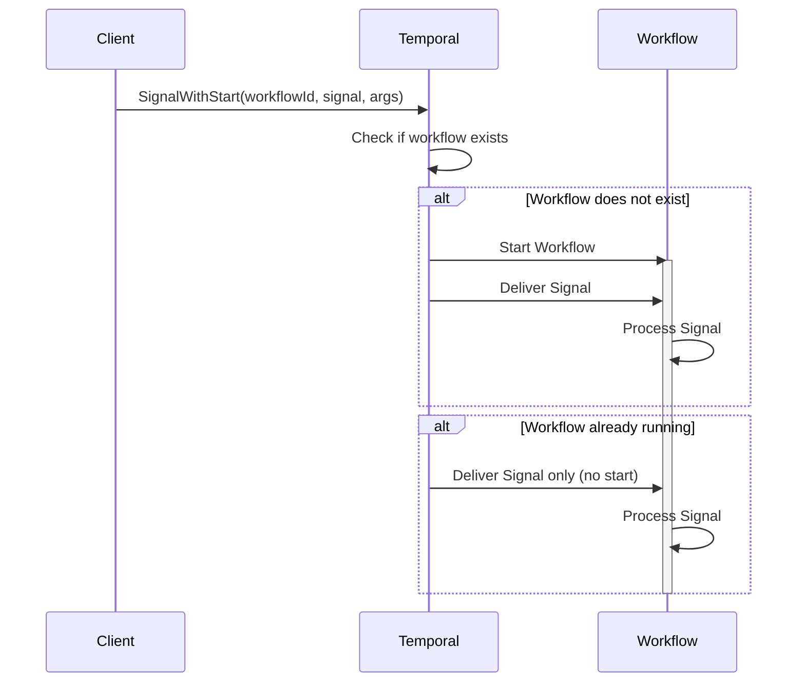

# Signal with Start Pattern

## Overview

Signal with Start is a pattern that lazily creates workflows when signaling them. If the workflow is already running, it receives the signal; if not, the workflow starts first and then receives the signal. This enables entity workflows that only exist when needed and can receive operations throughout their lifetime.

## Problem

In distributed systems, you often need workflows that:
- Represent long-lived entities (accounts, shopping carts, user sessions)
- Consume events from streams (Kafka, SQS) and trigger certain behaviors of an aggregate or entity
- Receive multiple operations over time
- Should only exist when there's work to do
- Need to handle the first operation without special client logic

Without Signal with Start, clients must:
- Check if the workflow exists before signaling
- Start the workflow if it doesn't exist, then signal it
- Handle race conditions when multiple clients try to start the same workflow
- Write complex coordination logic

## Solution

Temporal's Signal with Start API atomically starts a workflow (if not running) and delivers a signal in a single operation. The client doesn't need to know whether the workflow exists—the platform handles it automatically.



## Implementation

### Basic Signal with Start

::: code-group

```java [Java]
public class ShoppingCartManager {
  public void addItem(String cartId, String itemId, String productId, int quantity) {
    WorkflowOptions options = WorkflowOptions.newBuilder()
        .setWorkflowId("cart-" + cartId)  // Stable ID for entity
        .setTaskQueue("carts")
        .build();
    
    ShoppingCartWorkflow workflow = 
        workflowClient.newWorkflowStub(ShoppingCartWorkflow.class, options);
    
    // Atomically start workflow (if needed) and deliver signal
    BatchRequest request = workflowClient.newSignalWithStartRequest();
    request.add(workflow::run);  // Workflow method to start
    request.add(workflow::addItem, itemId, productId, quantity);  // Signal to deliver
    workflowClient.signalWithStart(request);
  }
}

@WorkflowInterface
public interface ShoppingCartWorkflow {
  @WorkflowMethod
  void run();
  
  @SignalMethod
  void addItem(String itemId, String productId, int quantity);
}

public class ShoppingCartWorkflowImpl implements ShoppingCartWorkflow {
  private Set<String> processedItems = new HashSet<>();  // Track processed items
  private List<CartItem> items = new ArrayList<>();
  
  @Override
  public void run() {
    Workflow.await(() -> false); // Run forever (entity workflow)
  }
  
  @Override
  public void addItem(String itemId, String productId, int quantity) {
    if (!processedItems.add(itemId)) {
      return; // Idempotency: ignore duplicate signals
    }
    items.add(new CartItem(productId, quantity));
  }
}
```

```typescript [TypeScript]
export async function addItem(
  cartId: string,
  itemId: string,
  productId: string,
  quantity: number
) {
  // Atomically start workflow (if needed) and deliver signal
  const handle = await client.workflow.signalWithStart(shoppingCartWorkflow, {
    workflowId: `cart-${cartId}`,  // Stable ID for entity
    taskQueue: 'carts',
    signal: 'addItem',
    signalArgs: [itemId, productId, quantity],
  });
}

export async function shoppingCartWorkflow(): Promise<void> {
  const processedItems = new Set<string>();  // Track processed items
  const items: CartItem[] = [];

  // Register signal handler before workflow logic
  setHandler(addItemSignal, (itemId: string, productId: string, quantity: number) => {
    if (processedItems.has(itemId)) {
      return; // Idempotency: ignore duplicate signals
    }
    processedItems.add(itemId);
    items.push({ productId, quantity });
  });

  await condition(() => false); // Run forever (entity workflow)
}

export const addItemSignal = defineSignal<[string, string, number]>('addItem');
```

```go [Go]
func AddItem(ctx context.Context, cartID, itemID, productID string, quantity int) error {
	opts := client.StartWorkflowOptions{
		ID:        "cart-" + cartID,  // Stable ID for entity
		TaskQueue: "carts",
	}

	// Atomically start workflow (if needed) and deliver signal
	_, err := c.SignalWithStartWorkflow(ctx, opts, ShoppingCartWorkflow,
		"addItem", AddItemSignal{ItemID: itemID, ProductID: productID, Quantity: quantity})
	return err
}

func ShoppingCartWorkflow(ctx workflow.Context) error {
	processedItems := make(map[string]bool)  // Track processed items
	var items []CartItem

	// Listen for signals in a coroutine
	addItemCh := workflow.GetSignalChannel(ctx, "addItem")
	workflow.Go(ctx, func(ctx workflow.Context) {
		for {
			var sig AddItemSignal
			addItemCh.Receive(ctx, &sig)
			if processedItems[sig.ItemID] {
				continue // Idempotency: ignore duplicate signals
			}
			processedItems[sig.ItemID] = true
			items = append(items, CartItem{ProductID: sig.ProductID, Quantity: sig.Quantity})
		}
	})

	workflow.Await(ctx, func() bool { return false }) // Run forever (entity workflow)
	return nil
}
```

:::

## Key Components

1. **Workflow ID**: Derived from business entity (account ID, user ID, session ID)
2. **Signal Handler**: Processes incoming operations with idempotency checks
3. **BatchRequest**: Container for workflow method and signal(s) to execute atomically
4. **WorkflowInit**: Optional constructor for initialization before signals are delivered (Java and .NET only)

## When to Use

**Ideal for:**
- Entity workflows (accounts, shopping carts, user sessions, clusters)
- Event-driven architectures (Kafka consumers, message queue processors)
- Workflows that receive multiple operations over their lifetime
- Lazy entity creation—only create when first operation arrives
- Fire-and-forget operations where immediate response isn't needed

**Not ideal for:**
- One-time operations (use REJECT_DUPLICATE policy instead)
- Request-response patterns requiring synchronous confirmation (use Update with Start)
- Operations that need immediate return values

## Benefits

- **Atomic Operation**: Start and signal happen atomically—no race conditions
- **Lazy Creation**: Workflows only exist when needed
- **Simplified Client**: No need to check if workflow exists
- **Idempotent**: Safe to retry—duplicate starts are handled by Workflow ID
- **Entity Pattern**: Natural fit for long-lived business entities

## Trade-offs

- **Fire-and-Forget**: No immediate confirmation that signal was processed
- **Signal Idempotency**: Still need to track processed operation IDs in workflow
- **Long-Running**: Workflows must handle unbounded execution (use continue-as-new)
- **No Return Value**: Signals don't return values (use queries or updates for that)

## Workflow ID Reuse Policies

Both **ALLOW_DUPLICATE** and **ALLOW_DUPLICATE_FAILED_ONLY** work well with Signal with Start:

- **ALLOW_DUPLICATE** (default): Allows new run regardless of previous runs—terminates existing workflow and starts fresh
- **ALLOW_DUPLICATE_FAILED_ONLY**: Allows restart only if previous run failed—prevents accidental restarts of running workflows
- **REJECT_DUPLICATE**: Prevents any duplicate starts—useful for one-time operations, not entity workflows
- **TERMINATE_IF_RUNNING**: Terminates running workflow and starts new one—use with caution

## Comparison with Alternatives

| Approach | Use Case | Response Type | Idempotency |
|----------|----------|---------------|-------------|
| Signal with Start | Entity workflows | Fire-and-forget | Signal-level |
| Update with Start | Request-response | Sync return value | Update-level |
| REJECT_DUPLICATE | One-time operations | Async (Workflow ID) | Workflow-level |

## Related Patterns

- **Entity Workflow**: Long-running workflows representing business entities
- **Idempotent Operations**: Preventing duplicate processing
- **Continue-As-New**: Managing unbounded workflow history
- **Safe Message Passing**: Concurrent signal handling with locking

## Best Practices

1. **Derive Workflow ID from Entity**: Use stable business identifiers (account ID, user ID)
2. **Implement Signal Idempotency**: Track processed operation IDs to prevent duplicates
3. **Use WorkflowInit**: Initialize state before signals are delivered (Java and .NET only)
4. **Handle Unbounded Execution**: Use continue-as-new for long-running entity workflows
5. **Choose Right Workflow ID Policy**: Use ALLOW_DUPLICATE_FAILED_ONLY for entity workflows
6. **Include Operation IDs**: Every signal should include a unique operation/reference ID
7. **Return Early**: Check for duplicates at the start of signal handlers
