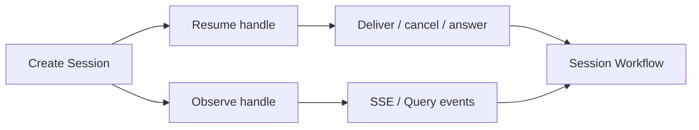

<h1>Split Resume and Observe Handles </h1>

## Overview

The Split Resume and Observe Handles pattern issues two distinct credentials for every Session: a **resume handle** that authorizes Delivery / cancel / answer, and an **observe handle** that only streams or Queries events—so possession of a Session id for watching never grants write power.
Primitives used: opaque continuation / capability tokens, HTTP Channel Agent, Idempotent Delivery, Validated Session Ingress, Identity (actor/owner).

## Problem

If `session_id` (Workflow Id) is both the stream address and the write credential, any leak—logs, support screenshots, shared “watch this chat” links—lets an observer inject Turns, approvals, or cancels.
Treating Temporal Workflow Id as a secret is fragile: Visibility, metrics, and ops tooling routinely expose it.

## Solution

At Session create, return:

| Handle | Authorizes | Typical form |
| :--- | :--- | :--- |
| Resume / write | Delivery, cancel, ask/approval answers | High-entropy token or signed capability (`cont_…`) |
| Observe / read | Event stream, status Queries | `session_id` + optional read-scoped token |

Map resume tokens to Session + principal in the channel tier (or a capability store).
Workflow Updates still require the channel to prove the resume token before calling Temporal.
Never accept Deliveries that present only a known Workflow Id.



The following describes each step in the diagram:

1. Session create mints resume and observe handles.
2. Writers present the resume handle on every mutating channel call.
3. Observers use the observe handle (or Session id + read ACL) for streams only.
4. The channel rejects mutations that lack a valid resume capability.

```python
# Channel-tier sketch (not inside Workflow code)
def create_session(owner_id: str) -> dict:
    session_id = f"session-{owner_id}-{new_id()}"
    resume = mint_capability(kind="resume", session_id=session_id, owner_id=owner_id)
    observe = mint_capability(kind="observe", session_id=session_id, owner_id=owner_id)
    start_session_workflow(session_id, owner_id)
    return {"session_id": session_id, "resume_token": resume, "observe_token": observe}

def deliver(resume_token: str, delivery_id: str, text: str) -> dict:
    cap = verify_capability(resume_token, kind="resume")
    return update_deliver(cap.session_id, delivery_id, text, actor_id=cap.owner_id)
```

## Implementation

<DaytonaRunner pattern="split-resume-observe-handles" />

### Token contents

Prefer opaque server-side ids or short-lived signed JWTs with `aud=resume|observe`, `sid`, `sub`, expiry.
Do not embed secrets or tool credentials in tokens.

### Workflow Id still exists

Temporal Workflow Id remains `session_id` for Signal-with-Start and ops.
Public product APIs should not treat it as sufficient for write.

### Sharing

“Share read-only” issues an observe token (or ACL row).
Revoke resume without killing observe when a device is lost.

### Pairing

Combine with [Delivery Authorization Timing](/delivery-authorization-timing) so long parks re-check the principal on apply when required.

## When to use

Use for every multi-user or link-shareable agent product.
Skip only for single-tenant internal tools where Workflow Id access equals full trust.

## Benefits and trade-offs

You stop observe-path leaks from becoming write compromises.
You operate a capability store or signing keys and teach clients two handles.

## Comparison with alternatives

| Approach | Observe leak risk | Ops Visibility |
| :--- | :--- | :--- |
| Split handles | Low for writes | Session id still listable |
| Session id as write secret | High | Conflicts with ops |
| Cookie session only | Medium | Harder for service clients |

## Best practices

- **Mint both handles at create**; rotate resume independently.
- **Authorize resume on every mutation** before Temporal Update.
- **Log handle kind**, not raw tokens.
- **Document that Workflow Id ≠ write credential.**

## Common pitfalls

- **Accepting Deliveries with only `session_id`.**
- **Putting resume tokens in SSE URLs** that get logged.
- **Equating Temporal API key access with end-user resume rights.**
- **Sharing one token for read and write.**

## Related patterns

- [HTTP Channel Agent](/http-channel-agent)
- [HTTP and Client](/http-and-client)
- [Validated Session Ingress](/validated-session-ingress)
- [Idempotent Delivery](/idempotent-delivery)
- [Delivery Authorization Timing](/delivery-authorization-timing)
- [Identity](/identity)
- [Progress Streaming](/progress-streaming)

## Sample code

- [`sandbox-runner/patterns/split-resume-observe-handles/python/`](https://github.com/temporal-sa/temporal-agentic-patterns/tree/main/sandbox-runner/patterns/split-resume-observe-handles/python)

## References

- [Temporal Docs: Security](https://docs.temporal.io/security)
- [Temporal Docs: Visibility](https://docs.temporal.io/visibility)
