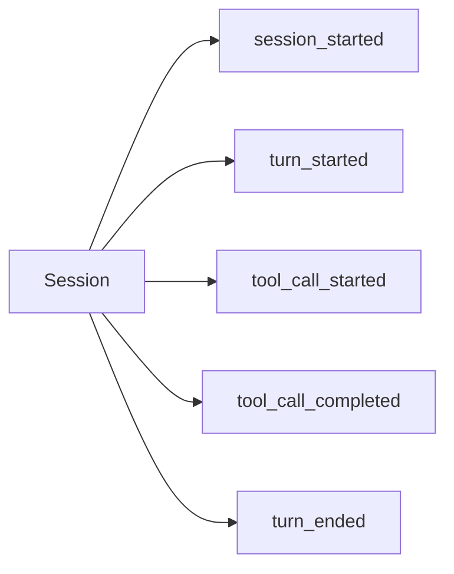

<h1>Standardized Event Stream </h1>

## Overview

The Standardized Event Stream pattern emits a single, structured event stream per session that includes every turn, step, tool call, approval, and subagent interaction.
UIs, logs, and analytics read from this stream to visualize and debug agents.
Primitives used: event metadata (`protocol_version`, `session_id`, `turn_id`, `step_id`), session/turn/step/tool/approval events.

## Problem

Without a shared stream, each agent invents logs, and operators cannot reconstruct a run without reading Temporal history.
Product UIs and evals need a stable contract.

## Solution

Append typed events as the Session executes.
Every event carries shared metadata plus a type-specific payload.
Given the stream alone, an observer can rebuild the conversation, tools, approvals, and costs.

The following describes each step in the diagram:

1. Session start opens the stream.
2. Each Turn and Step emits start and end (or failure) events.
3. Consumers tail the stream over SSE/NDJSON or read a persisted log.

## Implementation

Store events in Workflow state for short sessions, or externalize append-only storage via Activities for long sessions while keeping sequence numbers in the Session.
Search attributes should mirror `sessionId`, `turnId`, and status for operations.

### Minimum event types

- `session_started` / `session_ended`
- `turn_started` / `turn_ended`
- `step_started` / `step_completed` / `step_failed`
- `tool_call_*`, `model_call_*`, `approval_*`, `callback_*`, `subagent_*`

## When to use

Use this pattern for every production agent UI or audit requirement.
Skip a full stream only for throwaway prototypes.

## Benefits and trade-offs

You get reconstructability and shared tooling.
You must version the event schema and bound payload size.

## Comparison with alternatives

| Approach | Reconstructability | Coupling |
| :--- | :--- | :--- |
| Standardized stream | High | Shared contract |
| Temporal history only | Medium | UI tied to Temporal |
| Ad-hoc logs | Low | Per agent |

## Best practices

- **Stable event types.** Add fields carefully; version the protocol.
- **Redact secrets.** Never put credentials in payloads.
- **Include IDs.** Every event should tie back to session/turn/step.

## Common pitfalls

- **Logging instead of events.** Logs lack a typed contract.
- **Huge payloads.** Summarize model IO; store blobs elsewhere.
- **Gaps on Continue-As-New.** Carry sequence numbers in the snapshot.

## Related patterns

- [Follow-up Suggestions](/follow-up-suggestions)
- [Session Workflow](/session-workflow)
- [Agent Tracing](/agent-tracing)
- [Cost & Token Accounting](/cost-token-accounting)

## Sample code

The [Session Workflow](/session-workflow) sample returns a compact in-memory event list for teaching.

## References

- [Temporal Docs: Visibility](https://docs.temporal.io/visibility)
