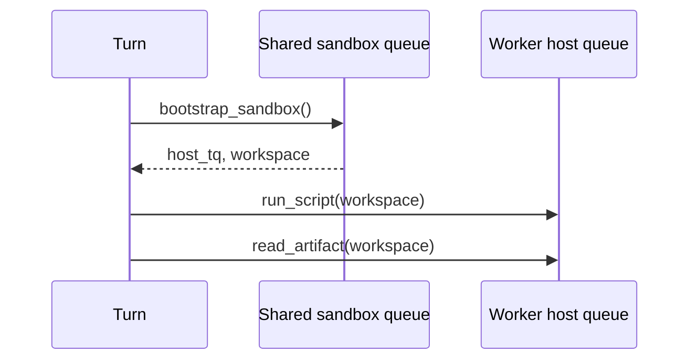

<h1>Sticky Sandbox Task Queues </h1>

## Overview

The Sticky Sandbox Task Queues pattern pins sandbox or host-local tool Activities to the Worker that owns the session files, containers, or browser profile—using a host-specific Task Queue returned from the first Activity.
Primitives used: Worker-specific Task Queue, Code Mode / Tools-Only Sandbox, Activity Tool `task_queue` override, schedule_to_start timeout.

## Problem

Code Mode and filesystem authoring often leave state on one machine: a temp workspace, a running container, a browser profile, a GPU slot.
If the next tool Activity lands on a different Worker, paths disappear and the script fails.
Shared network filesystems add complexity and races; forcing every Step through remote object storage slows the inner tool loop.

## Solution

Use a two-tier queue design:

1. Schedule a bootstrap Activity on the shared sandbox/tool queue; any Worker may claim it.
2. That Activity returns a **host-specific Task Queue name** (and local handles).
3. Later sandbox Activities for that Session/Turn target that host queue so they run on the same Worker.



The following describes each step in the diagram:

1. The Turn starts `bootstrap_sandbox` on the shared queue.
2. The chosen Worker creates local state and returns its sticky Task Queue name.
3. Subsequent sandbox Activities use that queue and therefore the same host.
4. Set a short `schedule_to_start_timeout` so a dead host fails fast instead of stalling forever.

```python
from datetime import timedelta

from temporalio import activity, workflow

@activity.defn
async def bootstrap_sandbox(session_id: str) -> dict:
    workspace = create_workspace(session_id)
    return {
        "workspace": workspace,
        "host_task_queue": activity.info().task_queue + "-" + host_id(),
    }

# Turn Workflow
boot = await workflow.execute_activity(
    bootstrap_sandbox,
    session_id,
    task_queue="sandbox-shared",
    start_to_close_timeout=timedelta(minutes=2),
    heartbeat_timeout=timedelta(seconds=20),
)
await workflow.execute_activity(
    run_script,
    args=[boot["workspace"], script],
    task_queue=boot["host_task_queue"],
    schedule_to_start_timeout=timedelta(seconds=15),
    start_to_close_timeout=timedelta(minutes=5),
    heartbeat_timeout=timedelta(seconds=30),
)
```

Workers must poll both the shared queue and their own `…-<host_id>` queue.

## Implementation

### Lifecycle

Destroy the workspace on Turn cancel, Turn end, or Session Continue-As-New policies you define.
Sticky queues do not garbage-collect disks for you.

### Failover

If the sticky host dies, `schedule_to_start_timeout` fires.
Bootstrap a new sandbox on the shared queue rather than retrying forever on a dead host queue.

### Security

Sticky host affinity concentrates tenant files on one disk—combine with [Network & Resource Sandboxing](/network-resource-sandboxing) and per-session isolation.
Do not reuse a host workspace across tenants.

### When Claim-Check is better

If artifacts must survive any Worker, write them to external storage ([Claim-Check Payloads](/claim-check-payloads), [Externalized Memory](/externalized-memory)) and keep Activities non-sticky.

## When to use

Use for Code Mode, browser tools, or GPU jobs that need host-local state across multiple Activities in one Turn.
Prefer shared storage + non-sticky Activities when durability across hosts matters more than locality.
Prefer Nexus or remote sandboxes when another Namespace owns the compute.

## Benefits and trade-offs

You keep fast local IO for multi-step sandbox Turns.
You accept host affinity, sticky-queue ops, and explicit failover when that host disappears.

## Comparison with alternatives

| Approach | Locality | Host failure |
| :--- | :--- | :--- |
| Sticky Sandbox Task Queues | Same Worker | Fail + re-bootstrap |
| Shared network FS | Any Worker | Complex consistency |
| Claim-check only | Stateless Workers | Retry anywhere |

## Best practices

- **Always set schedule_to_start_timeout** on sticky Activities.
- **Heartbeat long sandbox Steps** ([Heartbeat Long Steps](/heartbeat-long-steps)).
- **Name host queues uniquely per Worker process** and register them at Worker start.
- **Cancel sticky work on Turn cancel** so disks and containers do not leak.

## Common pitfalls

- **Forgetting the host Worker polls its sticky queue.** Activities never start.
- **No schedule_to_start timeout.** Turns hang when the sticky host dies.
- **Sharing one sticky workspace across Sessions.** Cross-tenant data leaks.
- **Putting Session Workflow Tasks on the sticky queue.** Keep Workflow scheduling on the shared agent queue.

## Related patterns

- [Code Mode Orchestrator](/code-mode-orchestrator)
- [Tools-Only Sandbox](/tools-only-sandbox)
- [Network & Resource Sandboxing](/network-resource-sandboxing)
- [Filesystem Authoring](/filesystem-authoring)
- [Heartbeat Long Steps](/heartbeat-long-steps)
- [Claim-Check Payloads](/claim-check-payloads)

## Sample code

Compose with the [Code Mode Orchestrator](/code-mode-orchestrator) sample: bootstrap returns `host_task_queue`, and `run_script` Activities target that queue.

## References

- [Temporal Docs: Task Queues](https://docs.temporal.io/task-queue)
- [Temporal Docs: Activity Task Queue routing](https://docs.temporal.io/activities)
