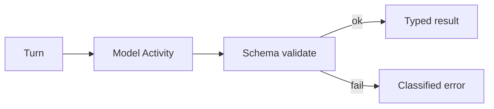

<h1>Structured Model Output </h1>

## Overview

The Structured Model Output pattern asks the model for schema-validated responses (for example Pydantic models) inside a Durable Model Call Activity.
The Turn receives typed data instead of free text that later steps must re-parse.
Primitives used: Durable Model Call, Tool/Operation schemas, typed Activity results.

## Problem

Free-text model replies force brittle parsing in the Workflow.
Invalid shapes cause confusing failures deep in the tool loop.

## Solution

Declare a response schema and have the model Activity return a validated object.
On validation failure, classify the error (often non-retryable or a model retry with repair instructions).



The following describes each step in the diagram:

1. The Turn requests a structured response format.
2. The model Activity calls the provider with that schema.
3. Validation runs before the Activity completes successfully.
4. The Workflow consumes a typed object without regex parsing.

```python
class AnalysisResult(BaseModel):
    sentiment: str
    confidence: float
    summary: str

@activity.defn
async def analyze_text(text: str) -> AnalysisResult:
    # Provider structured-output / parse API runs in the Activity.
    return await provider.parse(text, schema=AnalysisResult)
```

## Implementation

<DaytonaRunner pattern="structured-model-output" />


### Data converter

Use a Pydantic-friendly data converter on the Temporal Client and Worker so complex models serialize cleanly.

### Repair loops

Optionally retry once with the validation errors appended; cap repairs.

## When to use

Use when later Steps need fields, not prose.
Keep free text for user-facing chat replies.

## Benefits and trade-offs

You fail fast on bad shapes and keep Workflows free of ad-hoc parsing.
Schemas must evolve carefully alongside prompts.

## Comparison with alternatives

| Output style | Workflow safety |
| :--- | :--- |
| Structured schema | High |
| JSON in prose | Medium |
| Free text only | Low for automation |

## Best practices

- **Validate in the Activity** before completion.
- **Version schemas** when fields change.
- **Keep schemas small** for reliability.

## Common pitfalls

- **Validation failures treated as retryable forever.** Raise non-retryable ApplicationError or cap repair loops so bad shapes do not spin.
- **Changing schemas mid-session without a schema or prompt version pin.** In-flight Turns get mismatched expectations.
- **Huge nested schemas that models rarely satisfy.** Prefer small, flat contracts.
- **Parsing JSON with ad-hoc string splits in the Workflow.** Validate in the Activity and return typed results.

## Related patterns

- [Durable Model Call](/durable-model-call)
- [Agent Tool Loop](/agent-tool-loop)
- [Type-Checked Scripts](/type-checked-scripts)

## Sample code

- [`sandbox-runner/patterns/structured-model-output/python/`](https://github.com/temporal-sa/temporal-agentic-patterns/tree/main/sandbox-runner/patterns/structured-model-output/python)

## References

- [Temporal Docs: Data conversion](https://docs.temporal.io/dataconversion)
