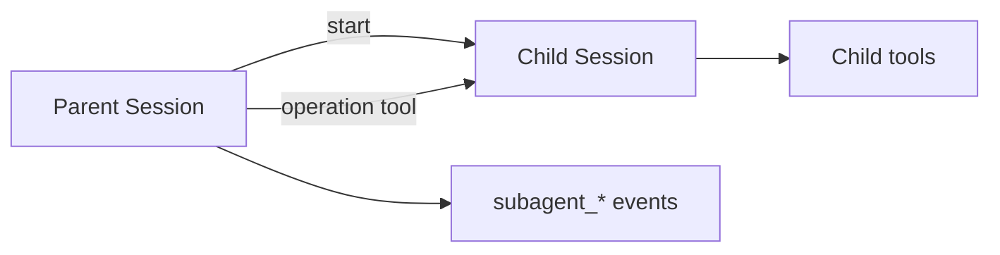

<h1>Subagent Toolset </h1>

## Overview

The Subagent Toolset pattern treats another agent as a typed toolset.
A parent agent starts a subagent session and calls its operations through tools, while the subagent runs its own Workflow and tools.
Primitives used: SubagentDefinition, SubagentHandle, ToolCalls into child operations, subagent events.

## Problem

Multi-agent systems that pass only free-text between agents lose structure, approvals, and clear parent/child audit trails.

## Solution

Expose the child agent's operations as tools on the parent.
Starting the child creates a SubagentHandle (`parent_session_id`, `child_session_id`).
Each operation call is a ToolCall Step that drives the child Session and emits `subagent_*` events.



The following describes each step in the diagram:

1. The parent selects a subagent toolset.
2. It starts or attaches a child Session and records `subagent_started`.
3. Operation calls become tool Steps against the child.
4. Completion or failure emits `subagent_completed` / `subagent_failed`.

```python
# Parent Workflow sketch
child = await workflow.start_child_workflow(
    ResearcherAgent.run,
    args=[child_session_id],
    id=child_session_id,
)
result = await workflow.execute_child_workflow(
    # or signal/update the child operation surface
    ResearcherAgent.run_research,
    args=[query],
    id=f"{child_session_id}-op-1",
)
```

## Implementation

### Typed operations

Prefer schema-validated operation inputs/outputs over raw chat strings when the parent is composing programmatically.

### Approvals

Parent policy may still gate starting a subagent or calling sensitive child operations.

## When to use

Use for specialization (planner → researcher → executor).
Keep a single agent when one toolset is enough.

## Benefits and trade-offs

You compose agents with contracts and durable isolation.
You must design failure and cancellation across parent and child.

## Comparison with alternatives

| Approach | Contract | Durability |
| :--- | :--- | :--- |
| Subagent Toolset | Typed ops | Child Session |
| Prompt chaining only | Text | Weak |
| Shared threads | Informal | Contended |

## Best practices

- **Link IDs in events.** UI trees need parent/child edges.
- **Bound child lifetime.** Close or idle children explicitly.
- **Propagate cancellation.** Parent abort should stop children when appropriate.

## Common pitfalls

- **Fire-and-forget child with `ParentClosePolicy=ABANDON`.** Cancelled or completed parents leave children burning indefinitely.
- **Orphan children after parent Continue-As-New without handles in the snapshot.**
- **Child handles not carried across parent Continue-As-New.** You cannot cancel, signal, or await those children after the new run starts.

## Related patterns

- [Fan-Out Subagents](/fanout-subagents)
- [Persistent Subagent Threads](/persistent-subagent-threads)
- [Remote Subagent](/remote-subagent)
- [Typed Agent Operations](/typed-agent-operations)

## Sample code

See related runnable samples under `sandbox-runner/patterns/` when this pattern builds on Session Workflow, Activity Tool, or Code Mode.

## References

- [Temporal Docs: Child Workflows](https://docs.temporal.io/child-workflows)
