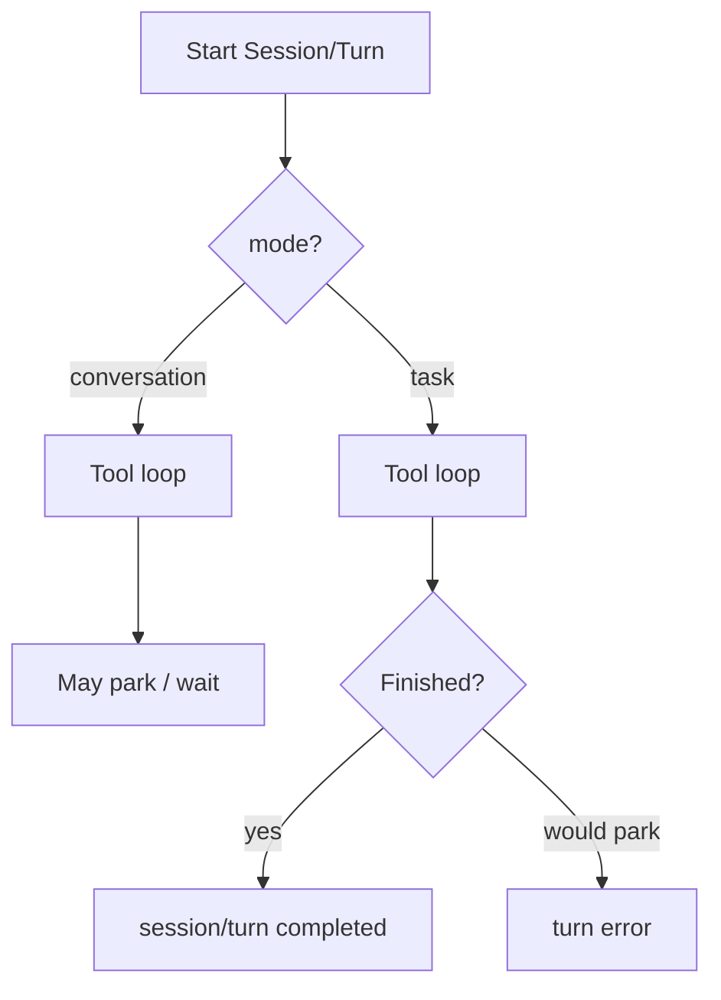

<h1>Task-Mode Session </h1>

## Overview

The Task-Mode Session pattern pins a Session (or Turn) to **task** mode: it must finish inside the current invocation and must not park for human input, OAuth, or the next chat message—unlike **conversation** mode, which may wait and resume.
Primitives used: Session mode flag (`task` | `conversation`), Turn Workflow completion contract, Scheduled Agent Turns, Subagent Toolset (one-shot children).

## Problem

Interactive Sessions park on ask-user, approvals, and connection grants.
Schedules, CI agents, and one-shot subagents that reuse the same loop will hang forever if a Step tries to wait for a person.
You need a durable mode that turns “would park” into a terminal Turn error.

## Solution

At Session (or Turn) start, set `mode=task`.

| Mode | May park for human / next message? | Terminal when unmet |
| :--- | :--- | :--- |
| `conversation` | Yes | Waiting / idle is valid |
| `task` | No | Unmet wait or schema → Turn error |



The following describes each step in the diagram:

1. Start records `mode` in Session/Turn state.
2. Conversation mode may emit waiting boundaries and resume later.
3. Task mode runs the same tool loop but rejects park paths.
4. Task Turns complete or fail; they do not idle for a human.

```python
from dataclasses import dataclass
from datetime import timedelta

from temporalio import workflow
from temporalio.exceptions import ApplicationError

@dataclass
class TurnInput:
    mode: str  # "task" | "conversation"
    user_message: str

@workflow.defn
class AgentTurnWorkflow:
    def __init__(self) -> None:
        self._human_reply: str | None = None

    @workflow.signal
    def human_reply(self, text: str) -> None:
        self._human_reply = text

    @workflow.run
    async def run(self, inp: TurnInput) -> str:
        needs_clarification = "?" in inp.user_message
        if needs_clarification:
            if inp.mode == "task":
                raise ApplicationError(
                    "task_mode_cannot_wait",
                    type="TaskModeCannotWait",
                    non_retryable=True,
                )
            await workflow.wait_condition(lambda: self._human_reply is not None)
            return f"answered:{self._human_reply}"
        return await workflow.execute_activity(
            run_task,
            inp.user_message,
            start_to_close_timeout=timedelta(seconds=30),
        )
```

## Implementation

<DaytonaRunner pattern="task-mode-session" />

### Where to set mode

- Session create (chat product → `conversation`; `run` / schedule / one-shot subagent → `task`)
- Per-Turn override only when product rules allow (prefer Session-level pin)

### Structured output

If the Turn requires a schema and the model ends without filling it, task mode fails the Turn; conversation mode may ask the user to clarify.

### Schedules

Markdown/cron task Schedules belong in task mode so a missing approval cannot strand the Schedule chain.
Handler-style conversation Schedules that intentionally wait are a different product path—pin mode explicitly.

### Subagents

One-shot child Sessions that must return a value run in task mode.
Persistent child threads that idle on Signals are conversation-shaped; do not expose HITL inside them without [Root-Mediated Subagent Approvals](/root-mediated-subagent-approvals).

## When to use

Use for scheduled agents, CLI one-shots, CI evals, and one-shot subagent tools.
Use conversation mode for chat products that park for humans.

## Benefits and trade-offs

You prevent accidental infinite waits on automation paths.
You must fail closed when clarification would have helped—surface a clear `task_mode_cannot_wait` error.

## Comparison with alternatives

| Approach | Parks for human | Fit |
| :--- | :--- | :--- |
| Task-Mode Session | No | Schedules / one-shots |
| Conversation Session | Yes | Chat |
| Soft timeout then continue | Ambiguous | Hides intent |

## Best practices

- **Pin mode at create** and show it on Session Queries / Visibility.
- **Reject park tools** (ask-user, connection-auth) in task mode at policy check, not after emitting wait events.
- **Propagate mode to child one-shots** so nested agents cannot park.
- **Keep conversation as the chat default**; do not force task mode on interactive UX.

## Common pitfalls

- Starting a Schedule in conversation mode “because chat works.”
- Treating unmet structured output as a soft park in task mode.
- Expecting mid-run user Turns on a task Session.
- Exposing HITL Tools inside persistent subagent threads without a root proxy.

## Related patterns

- [Session Workflow](/session-workflow)
- [Turn Workflow](/turn-workflow)
- [Scheduled Agent Turns](/scheduled-agent-turns)
- [Ask-User Wait](/ask-user-wait)
- [Connection Auth Wait](/connection-auth-wait)
- [Subagent Toolset](/subagent-toolset)
- [Root-Mediated Subagent Approvals](/root-mediated-subagent-approvals)
- [Eager Interactive Session Start](/eager-interactive-session-start)

## Sample code

- [`sandbox-runner/patterns/task-mode-session/python/`](https://github.com/temporal-sa/temporal-agentic-patterns/tree/main/sandbox-runner/patterns/task-mode-session/python)

## References

- [Temporal Docs: Schedules](https://docs.temporal.io/workflows#schedule)
- [Temporal Docs: Child Workflows](https://docs.temporal.io/child-workflows)
