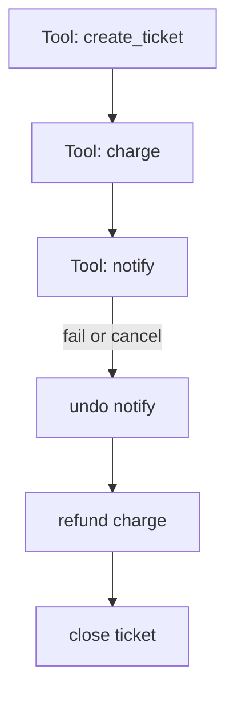

<h1>Tool Compensation </h1>

## Overview

The Tool Compensation pattern treats a multi-tool Turn as a saga: each non-idempotent tool Step registers a compensating Activity, and on later failure or Turn cancel the Session runs compensations in reverse order so partial side effects do not stay applied.
Primitives used: Activity Tool, compensation stack in Turn/Session Workflow state, Fan-Out / Best-Effort Parallel caveats, Approval-Gated Tools.

## Problem

Agent Turns often call several write tools—create ticket, charge card, send email, update CRM.
If a later Step fails or the user cancels, completed writes remain unless you undo them.
Blind retries and Best-Effort Parallel Tools make this worse: some branches succeed while others fail.
Idempotency alone does not roll back work that already committed externally.

## Solution

After each successful non-idempotent tool Step, push a compensation (tool name + undo args + idempotency key) onto a stack in Workflow state.
On terminal failure, cancel, or explicit abort, pop and run compensations newest-first as Activities.
Emit `compensation_*` events so audits show what was undone.
Skip compensation for inherently safe or idempotent read tools.



The following describes each step in the diagram:

1. The Turn runs write tools in order (or records per-branch compensations for parallel writes).
2. Each success registers an undo Activity before the next Step proceeds.
3. When a later Step fails or the Turn cancels, compensations run in reverse order.
4. Each compensation is itself an Activity Tool with retries and idempotency keys.

```python
from dataclasses import dataclass
from datetime import timedelta

from temporalio import workflow

@dataclass
class Compensation:
    activity: str
    args: dict

@workflow.defn
class AgentTurnWorkflow:
    @workflow.run
    async def run(self, goal: str) -> str:
        compensations: list[Compensation] = []
        try:
            ticket = await workflow.execute_activity(
                create_ticket, goal,
                start_to_close_timeout=timedelta(seconds=30),
            )
            compensations.append(
                Compensation("close_ticket", {"id": ticket["id"]})
            )

            charge = await workflow.execute_activity(
                charge_customer, ticket["id"],
                start_to_close_timeout=timedelta(seconds=30),
            )
            compensations.append(
                Compensation("refund_charge", {"id": charge["id"]})
            )

            await workflow.execute_activity(
                notify_user, ticket["id"],
                start_to_close_timeout=timedelta(seconds=30),
            )
            return ticket["id"]
        except Exception:
            for comp in reversed(compensations):
                await workflow.execute_activity(
                    run_named_tool,
                    args=[comp.activity, comp.args],
                    start_to_close_timeout=timedelta(seconds=60),
                )
            raise
```

## Implementation

<DaytonaRunner pattern="tool-compensation" />


### Register before vs after the write

Prefer registering compensation **before** the write when a crash mid-Activity could leave an external effect without an undo entry—compensation must tolerate "nothing to undo."
If the write is transactional with a returned id, registering immediately after success is acceptable when the Activity is all-or-nothing.

### Parallel tools

For [Best-Effort Parallel Tools](/best-effort-parallel-tools), collect per-branch compensations for successes even when siblings fail.
Do not compensate branches that never committed.

### Approvals

Run [Approval-Gated Tools](/approval-gated-tools) before the write; compensations should usually skip a second approval or use a tighter operator policy so undo is not stuck behind the same human gate that already approved the forward path.

### Cancel

On Turn cancel, run the compensation stack after in-flight Activities settle ([Turn Workflow](/turn-workflow)).
Cancel is not undo by itself.

### When not to saga

Read-only research Turns, pure model reasoning, and fully idempotent upserts often need no compensation—document that in the tool safety profile.

## When to use

Use when a Turn performs two or more non-idempotent external writes that must not leave orphans on failure or cancel.
Prefer idempotent upserts and Claim-Check side effects when you can avoid compensation entirely.

## Benefits and trade-offs

You get durable undo for agent side effects without distributed 2PC.
You must design every write tool's compensation and keep undo Activities idempotent.

## Comparison with alternatives

| Approach | Partial failure | Cancel |
| :--- | :--- | :--- |
| Tool Compensation | Reverse undo stack | Runs compensations |
| Idempotent upserts only | Retry-safe | No automatic undo |
| Best-Effort Parallel without undo | Keeps successes | Leaves orphans |
| Fail whole Session | Loses successful work | Harsh |

## Best practices

- **Label tools** `compensatable` in safety profiles with the undo tool id.
- **Pass idempotency keys** into both forward and reverse Activities.
- **Bound compensation retries** and alert when undo fails ([Agent Step Retry Alerting](/agent-step-retry-alerting)).
- **Record compensations in the event stream** for support and evals.

## Common pitfalls

- **Compensating read-only tools.** Noise and false undo attempts.
- **Non-idempotent undo.** Double cancel/refund on Activity retry.
- **Forgetting parallel successes.** One failed search sibling must not erase that a write sibling committed.
- **Blocking undo on the same approval as the forward write.** Cancels stall forever.
- **Assuming Temporal cancels external systems.** Only your compensation Activities talk to those APIs.

## Related patterns

- [Activity Tool](/activity-tool)
- [Safety-Profiled Tools](/safety-profiled-tools)
- [Best-Effort Parallel Tools](/best-effort-parallel-tools)
- [Fan-Out Subagents](/fanout-subagents)
- [Turn Workflow](/turn-workflow)
- [Approval-Gated Tools](/approval-gated-tools)
- [Agent Step Retry Alerting](/agent-step-retry-alerting)

## Sample code

- [`sandbox-runner/patterns/tool-compensation/python/`](https://github.com/temporal-sa/temporal-agentic-patterns/tree/main/sandbox-runner/patterns/tool-compensation/python)

## References

- [Temporal Docs: Activities](https://docs.temporal.io/activities)
- [Temporal Docs: Failure handling](https://docs.temporal.io/references/failures)
- Saga / compensation as a general distributed-systems pattern (apply to tool Steps, not only microservices)
