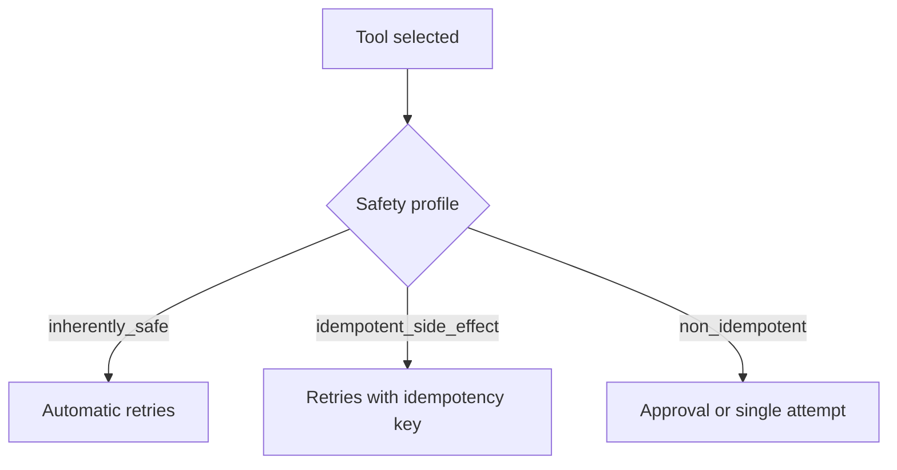

<h1>Tool Retry Profiles </h1>

## Overview

The Tool Retry Profiles pattern assigns retry and safety profiles per tool.
Read-only or idempotent tools can retry automatically; non-idempotent tools require approvals or idempotency keys.
Primitives used: StepPolicy, SafetyProfile, ToolDefinition defaults.

## Problem

A single global retry policy either double-executes payments or gives up too early on transient read failures.

## Solution

Attach a default StepPolicy and SafetyProfile to each ToolDefinition.
When the Turn schedules an Activity tool, apply that policy: attempt counts, backoff, and whether approval is required before the first attempt.



The following describes each step in the diagram:

1. Each tool declares safety and retry defaults.
2. The Turn loads the profile when scheduling the Step.
3. Safe tools retry; non-idempotent tools gate or require keys.
4. Failures emit classified tool_call_failed events.

```python
TOOL_POLICIES = {
    "search": {"maximum_attempts": 5, "safety": "inherently_safe"},
    "charge": {"maximum_attempts": 1, "safety": "non_idempotent"},
}

policy = TOOL_POLICIES[tool_name]
await workflow.execute_activity(
    run_tool,
    args=[tool_name, payload],
    start_to_close_timeout=timedelta(seconds=30),
    retry_policy=RetryPolicy(maximum_attempts=policy["maximum_attempts"]),
)
```

## Implementation

### Mapping to Temporal

Encode profiles as RetryPolicy and timeouts on `execute_activity`.
Keep the profile table next to tool definitions so authors cannot forget it.

### Interaction with approvals

Non-idempotent tools should usually combine a strict retry profile with Approval-Gated Tools.

## When to use

Use per-tool profiles whenever an agent has mixed read and mutate tools.
A single shared RetryPolicy is enough only for uniform read-only agents.

## Benefits and trade-offs

You avoid double side effects while still absorbing transient faults.
You must maintain profile metadata as tools evolve.

## Comparison with alternatives

| Profile | Retries | Typical tools |
| :--- | :--- | :--- |
| inherently_safe | Many | Search, fetch |
| idempotent_side_effect | Few + key | Upserts |
| non_idempotent | One or gated | Payments |

## Best practices

- **Default deny for unknown tools.** Missing profile should fail closed.
- **Document idempotency keys.** Put key fields in the tool schema.
- **Align metrics.** Tag retries by tool_id and profile.

## Common pitfalls

- **Copy-pasting payment retries onto read-only tools (or reverse).** Aggressive retries on payments risk double charges; timid retries on reads burn attempts without recovering.
- **Omitting a profile and inheriting Activity defaults.** Defaults are often too aggressive for mutating tools.
- **Silent profile overrides in one Turn.** Keep overrides explicit and evented.

## Related patterns

- [Safety-Profiled Tools](/safety-profiled-tools)
- [Approval-Gated Tools](/approval-gated-tools)
- [Activity Tool](/activity-tool)

## Sample code

See related runnable samples under `sandbox-runner/patterns/` when this pattern builds on Session Workflow, Activity Tool, or Code Mode.

## References

- [Temporal Docs: Retry policies](https://docs.temporal.io/encyclopedia/retry-policies)
