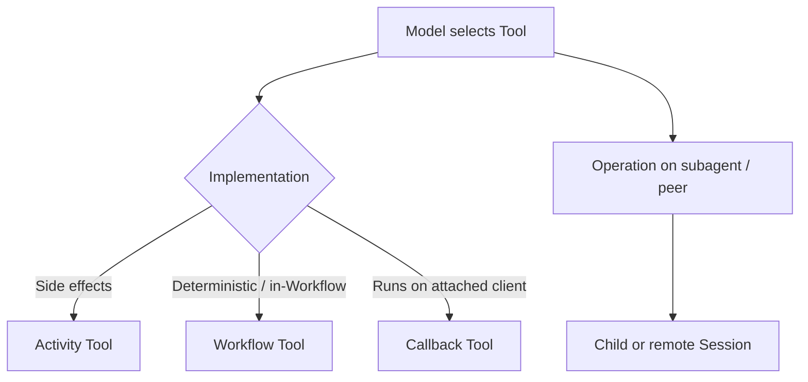

# Tools and Operations

## Overview

A Tool is a callable capability the agent may select during a Turn.
An Operation is a typed interface you expose when one agent drives another (or a client) through a stable contract rather than free-form tool JSON.

## Problem

Teams overload "tool" to mean HTTP APIs, in-process functions, child Workflows, and entire subagents.
Without shared terms, you cannot decide retries, determinism, or where side effects run.
You need a clear split between what the model selects and how that call is implemented on Temporal.

## Solution

Classify callables by role and by Temporal implementation:

The following describes each step in the diagram:

1. During a Turn, the model (or script) selects a Tool by name and arguments.
2. An Activity Tool runs as a Temporal Activity—timeouts, retries, and heartbeats apply to side effects.
3. A Workflow Tool runs in Workflow code when the work is deterministic and must not leave the Workflow sandbox.
4. A Callback Tool executes on an attached client; the Session waits for the result Signal or Update.
5. An Operation is a typed method on another agent or peer Session (for example, "summarize" or "search") rather than an unbounded tool catalog entry.

Prefer Operations when composing agents so callers depend on a versioned interface, not on another agent's internal tool names.

## When to use

Use Tool when describing model-selectable capabilities in a Session.
Use Operation when one agent or client invokes another through a typed API.
Choose Activity Tool, Workflow Tool, or Callback Tool based on where the side effect must run.

## Benefits and trade-offs

Clear types drive retry profiles, safety labels, and determinism checks.
The trade-off is more naming discipline when wrapping existing APIs.

## Comparison with alternatives

| Approach | Durability | Determinism |
| :--- | :--- | :--- |
| Activity Tool | High for side effects | Activity may be non-deterministic |
| Workflow Tool | High in history | Must stay deterministic |
| Ad-hoc HTTP from Workflow code | Unsafe | Breaks replay |

## Best practices

- **Name Tools for the model; implement with Activities.** Keep schemas stable across prompt versions.
- **Label safety.** Mark tools inherently safe, idempotent, or non-idempotent for approval and retry policy.
- **Prefer Operations for subagents.** Hide the callee's tool loop behind a typed contract.
- **Do not call external APIs from Workflow code.** That belongs in an Activity Tool or Callback Tool.

## Common pitfalls

- **Putting network I/O in a Workflow Tool.** Replay will diverge.
- **One mega-tool that does everything.** You lose per-tool retries and approvals.
- **Exposing another agent's raw tools as your Operations.** Coupling breaks when the callee changes tools.

## Related patterns

- [Activity Tool](/activity-tool)
- [Workflow Tool](/workflow-tool)
- [Callback Tool](/callback-tool)
- [Agent Tool Loop](/agent-tool-loop)
- [Subagent Toolset](/subagent-toolset)
- [Tool Retry Profiles](/tool-retry-profiles)

## Sample code

See [Activity Tool](/activity-tool) and [Workflow Tool](/workflow-tool) for implementation sketches.

## References

- [Temporal Docs: Activities](https://docs.temporal.io/activities)
- [Temporal Docs: Workflows](https://docs.temporal.io/workflows)
