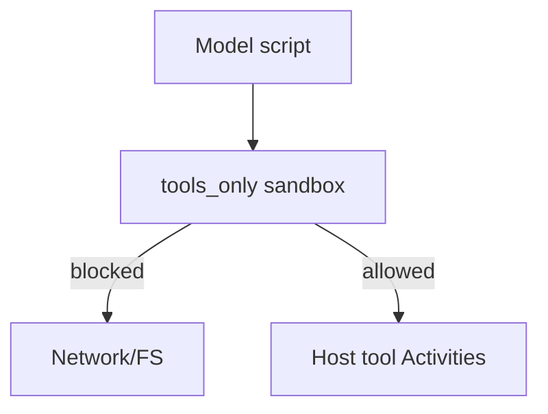

<h1>Tools-Only Sandbox </h1>

## Overview

The Tools-Only Sandbox pattern runs model-authored scripts in a locked-down sandbox where the only side effects are calls to host tools.
No direct filesystem or network; all real actions flow through Activity tools and their approval policies.
Primitives used: SandboxProfile `tools_only`, ScriptExecution, host ToolCallSteps.

## Problem

Giving a model a general code interpreter with network access bypasses tool approvals and safety profiles.

## Solution

Configure the sandbox so imports and syscalls cannot reach the network or host FS.
Expose only async host functions that dispatch back into durable tool Steps.



The following describes each step in the diagram:

1. The Code Mode Step selects the tools_only profile.
2. The script runs with host function stubs only.
3. Any real IO is a host tool Activity with events and approvals.
4. Direct network or filesystem use fails inside the sandbox.

```python
# Pseudocode profile
SANDBOX_PROFILES = {
    "tools_only": {
        "allow_network": False,
        "allow_filesystem": False,
        "host_tools": ["search", "book"],
    }
}
```

## Implementation

### Separating compute_only

Use `compute_only` when the script must not call host tools either (pure calculation).

### Enforcement

Enforcement belongs in the sandbox runtime, not in prompt instructions alone.

## When to use

Use tools_only for Code Mode in production.
Use richer profiles only in controlled development environments.

## Benefits and trade-offs

You keep approval and observability on the real side effects.
You must maintain a capable sandbox implementation.

## Comparison with alternatives

| Profile | Host tools | Network |
| :--- | :--- | :--- |
| tools_only | Yes | No |
| compute_only | No | No |
| unrestricted | Yes | Yes |

## Best practices

- **Fail closed on policy violations.**
- **Pass explicit allow lists of host tools into each Code Mode tool.**
- **Test escape attempts in CI.**

## Common pitfalls

- **Sandbox or code execution in the Workflow worker process.** Compromises the worker and blocks the event loop.
- **Host callbacks that are not Activities.** Side effects skip durability and retry policy.
- **Exposing a shell host tool that reopens the network.**

## Related patterns

- [Sandbox Profile Tiers](/sandbox-profile-tiers)
- [Code Mode Orchestrator](/code-mode-orchestrator)
- [Type-Checked Scripts](/type-checked-scripts)
- [Network & Resource Sandboxing](/network-resource-sandboxing)

## Sample code

See related runnable samples under `sandbox-runner/patterns/` when this pattern builds on Session Workflow, Activity Tool, or Code Mode.

## References

- [Temporal Docs: Activities](https://docs.temporal.io/activities)
