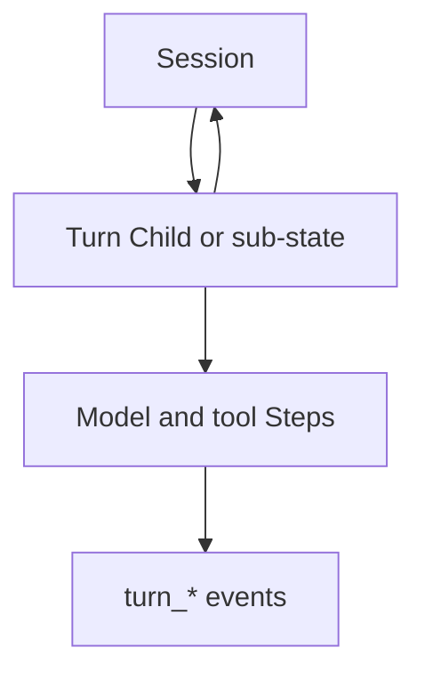

<h1>Turn Workflow </h1>

## Overview

The Turn Workflow pattern represents each agent turn (input → reply) as its own Child Workflow or explicitly tracked sub-state.
A turn encapsulates model reasoning, tool calls, and subagents, and emits a self-contained slice of the event stream.
Primitives used: Turn, TurnId, Step, Child Workflow (optional), turn events.

## Problem

When every turn shares one undifferentiated Workflow path, a stuck tool call or heavy child can block the whole session.
You also lose a clean unit for cancellation, timeouts, and per-turn metrics.

## Solution

Model each Turn as a bounded unit: either a Child Workflow started by the Session, or a Session sub-state with its own `turn_id`, step list, and timeout.
The Session remains the owner of memory and approvals; the Turn owns the work for one input.



The following describes each step in the diagram:

1. The Session receives an input and allocates a `turn_id`.
2. It starts a Turn Child Workflow or enters turn sub-state.
3. The Turn runs model and tool Steps, then returns a reply or error.
4. The Session merges results into memory and continues waiting for the next input.

```python
# Session starts an isolated turn
handle = await workflow.start_child_workflow(
    AgentTurnWorkflow.run,
    args=[session_id, turn_id, user_message],
    id=f"{session_id}-{turn_id}",
)
reply = await handle
```

## Implementation

### Child Workflow turns

Use Child Workflows when turns need strong isolation, independent timeouts, or parallelism with other turns.

### Embedded turns

Keep turns in Session state when isolation overhead is unnecessary, but still emit `turn_started` / `turn_ended` and track Steps explicitly.

## When to use

Use Turn Workflows when turns are independent, need cancellation, or must be metered separately.
Prefer embedded turns for short, tightly coupled chat loops.

## Benefits and trade-offs

You gain per-turn isolation and clearer observability.
You accept Child Workflow overhead or the discipline of explicit sub-state.

## Comparison with alternatives

| Approach | Isolation | Overhead |
| :--- | :--- | :--- |
| Turn as Child Workflow | High | Higher |
| Turn as Session sub-state | Medium | Lower |
| No turn boundary | Low | Lowest |

## Best practices

- **Always assign `turn_id`.** Search attributes and events depend on it.
- **Bound turn duration.** Use timeouts so a hung tool cannot stall the session forever.
- **Return typed outcomes.** Reply, error, and cancel should be explicit.

## Common pitfalls

- **Starting unbounded parallel turns.** Cap concurrency on the Session.
- **Duplicating session memory in every child.** Pass summaries, not full history.
- **Forgetting Parent Close Policy.** Decide whether children survive session stop.

## Related patterns

- [Session Workflow](/session-workflow)
- [Fan-Out Subagents](/fanout-subagents)
- [Standardized Event Stream](/standardized-event-stream)

## Sample code

See related runnable samples under `sandbox-runner/patterns/` when this pattern builds on Session Workflow, Activity Tool, or Code Mode.

## References

- [Temporal Docs: Child Workflows](https://docs.temporal.io/child-workflows)
