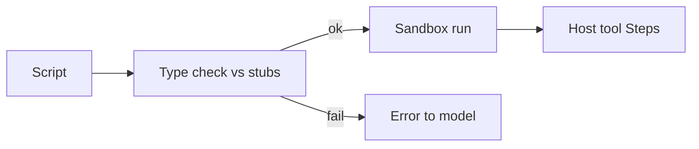

<h1>Type-Checked Scripts </h1>

## Overview

The Type-Checked Scripts pattern generates type stubs from ToolDefinitions and checks model-authored scripts against them before execution.
Scripts that call tools with wrong arguments or shapes fail fast with clear errors instead of running partial workflows.
Primitives used: ScriptDefinition, ToolDefinition schemas, pre-exec validation Step.

## Problem

Invalid scripts can call tools halfway, leave partial side effects, or waste a Turn on avoidable mistakes.

## Solution

Before sandbox execution, generate stubs from tool input/output schemas and run a static check.
On failure, return errors to the model or operator without executing host calls.



The following describes each step in the diagram:

1. ToolDefinitions produce type stubs for host functions.
2. The script is checked before any host call.
3. Failures short-circuit with actionable diagnostics.
4. Passing scripts proceed to tools_only execution.

```python
# Generated tooling registration example
stubs = generate_stubs(tool_definitions)
errors = typecheck(script_text, stubs)
if errors:
    return {"ok": False, "errors": errors}
return run_in_sandbox(script_text, host_dispatcher)
```

## Implementation

### Where it runs

Validation can be an Activity Step before sandbox run, or part of the Code Mode Activity before side effects.
Either way, emit events that distinguish check failure from host tool failure.

## When to use

Use whenever Code Mode is enabled.
Skipping checks is acceptable only in throwaway experiments.

## Benefits and trade-offs

You prevent many partial side-effect runs.
Stub generation must stay in sync with tool schemas.

## Comparison with alternatives

| Approach | Catches bad args | Side effects before fail |
| :--- | :--- | :--- |
| Type-Checked Scripts | Early | No |
| Runtime tool errors only | Late | Possible |
| Prompt-only instructions | Weak | Possible |

## Best practices

- **Regenerate stubs when tools change.**
- **Return model-readable errors.**
- **Do not execute host calls during check.**

## Common pitfalls

- **Checking a different script than you execute.**
- **Typecheck Activity performs host side effects.** Validation must be pure; writes belong in execute Activities.
- **Check result not recorded, so a retry runs a different script.** Without a durable check outcome, retries may typecheck and execute another script.

## Related patterns

- [Code Mode Orchestrator](/code-mode-orchestrator)
- [Tools-Only Sandbox](/tools-only-sandbox)
- [Tools and Operations](/tools-and-operations)

## Sample code

See related runnable samples under `sandbox-runner/patterns/` when this pattern builds on Session Workflow, Activity Tool, or Code Mode.

## References

- [Temporal Docs: Activities](https://docs.temporal.io/activities)
