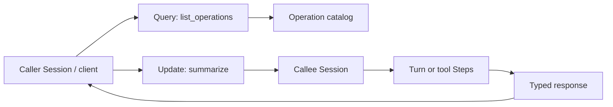

<h1>Typed Agent Operations </h1>

## Overview

The Typed Agent Operations pattern exposes a peer Session or subagent through versioned Query and Update handlers with explicit request and response types.
Callers invoke named Operations (`summarize`, `search`, `apply_patch`) instead of depending on another agent's internal tool catalog or free-form JSON.
Primitives used: Workflow Update, Workflow Query, typed request/response schemas, Subagent Toolset, optional Signal for fire-and-forget work.

## Problem

When one agent drives another through an unbounded tool list, the caller couples to the callee's prompt, tool names, and argument shapes.
HTTP-style free-form payloads skip Temporal validation, so bad arguments enter history before the callee can reject them.
You need a stable contract that survives callee tool-loop changes and supports discovery without reading the other agent's source.

## Solution

Register Operations as Workflow Updates (mutating, validated) and Queries (read-only snapshots) on the target Session or subagent Workflow.
Publish a small catalog of Operation names and schemas the caller can discover.
Implement each Operation by running a Turn, Activity Tool, or child work inside the callee; return a typed result to the caller.



The following describes each step in the diagram:

1. The caller Queries `list_operations` (or a static SDK stub) to learn names, versions, and schemas.
2. The caller sends an Update with a typed request body for the chosen Operation.
3. The Update validator rejects invalid arguments before the Operation runs.
4. The callee Session runs the work as a Turn or Steps and returns a typed response.
5. The caller treats the response like any other durable Step result.

```python
from dataclasses import dataclass
from datetime import timedelta

from temporalio import workflow

@dataclass
class SummarizeRequest:
    text: str
    max_tokens: int = 256

@dataclass
class SummarizeResponse:
    summary: str
    prompt_version: str

@workflow.defn
class SpecialistSession:
    @workflow.query
    def list_operations(self) -> list[dict]:
        return [
            {
                "name": "summarize",
                "version": "1",
                "kind": "update",
            }
        ]

    @workflow.update
    async def summarize(self, req: SummarizeRequest) -> SummarizeResponse:
        # Run a Turn / Durable Model Call; return typed fields.
        summary = await workflow.execute_activity(
            call_summarize_model,
            args=[req.text, req.max_tokens],
            start_to_close_timeout=timedelta(seconds=60),
        )
        return SummarizeResponse(summary=summary, prompt_version="summarize.v3")

    @summarize.validator
    def validate_summarize(self, req: SummarizeRequest) -> None:
        if not req.text.strip():
            raise ValueError("text required")
        if req.max_tokens < 1 or req.max_tokens > 4096:
            raise ValueError("max_tokens out of range")
```

## Implementation

<DaytonaRunner pattern="typed-agent-operations" />


### Updates vs Queries vs Signals

Use **Update** for Operations that must return a result and may mutate Session state (run a Turn, write memory).
Use **Query** for read-only views (catalog, status, last summary) that must not change history.
Use **Signal** when the caller can fire-and-forget and poll or wait on a later event; prefer Update when the caller needs acceptance and a return value.

### Discovery and versioning

Ship `list_operations` (or an equivalent Query) that returns name, version, and schema identifiers.
Bump Operation versions when request or response fields change incompatibly; keep prior handlers until callers migrate.
Pin `prompt_version` inside responses when the Operation wraps a Durable Model Call so evals stay reproducible.

### Composition with tools

Inside the callee, Operations may still use Activity Tools and an Agent Tool Loop.
Do not re-export the callee's raw tool names as the caller's Operations—that recreates the coupling this pattern removes.

### Cross-Namespace peers

When the peer lives in another Namespace, prefer a Nexus Tool that fronts the same typed contract rather than calling Updates across Namespace boundaries directly.

## When to use

Use Typed Agent Operations when one Session, client, or orchestrator invokes another agent through a stable API.
Prefer an Agent Tool Loop with Activity Tools when a single Session owns the model and tools.
Prefer Subagent Toolset Child Workflows when the parent only needs a one-shot `run(goal)` without a rich Operation surface.

## Benefits and trade-offs

You get validated entrypoints, clearer ownership of contracts, and safer composition across teams.
You take on schema versioning and a smaller public surface than "whatever tools the model invented today."

## Comparison with alternatives

| Approach | Contract | Validation |
| :--- | :--- | :--- |
| Typed Agent Operations | Named Update/Query APIs | Validator before work |
| Raw tool catalog on peer | Peer-internal tool names | Late / model-driven |
| HTTP Remote Subagent | Custom REST shapes | App-level only |
| Nexus Tool | Endpoint Operations | Nexus + handler contracts |

## Best practices

- **Keep the catalog small.** A few durable Operations beat dozens of thin wrappers.
- **Validate before side effects.** Reject bad arguments in Update validators.
- **Version Operations independently of Session Workflow code deploys** when callers are external.
- **Return structured errors** the caller can map into tool or step failure events.

## Common pitfalls

- **Exposing the callee's entire tool list as Operations.** The contract churns whenever prompts change.
- **Putting network I/O inside Update validators.** Validators must stay fast and deterministic.
- **Using Query for work that needs durability or retries.** Queries do not schedule Activities.
- **Skipping acceptance semantics.** Callers that ignore Update failure leave Turns half-started from their perspective.
- **Breaking schemas without a version bump.** In-flight callers deserialize into the wrong types after Continue-As-New or Worker rollout.

## Related patterns

- [Tools and Operations](/tools-and-operations)
- [Subagent Toolset](/subagent-toolset)
- [Structured Model Output](/structured-model-output)
- [Session with Signal-and-Start](/session-signal-and-start)
- [Nexus Tool](/nexus-tool)
- [Prompt Versioning](/prompt-versioning)

## Sample code

- [`sandbox-runner/patterns/typed-agent-operations/python/`](https://github.com/temporal-sa/temporal-agentic-patterns/tree/main/sandbox-runner/patterns/typed-agent-operations/python)

## References

- [Temporal Docs: Updates](https://docs.temporal.io/encyclopedia/workflow-message-passing#sending-updates)
- [Temporal Docs: Queries](https://docs.temporal.io/encyclopedia/workflow-message-passing#sending-queries)
- [Temporal Docs: Message passing — Python](https://docs.temporal.io/develop/python/workflows/message-passing)
