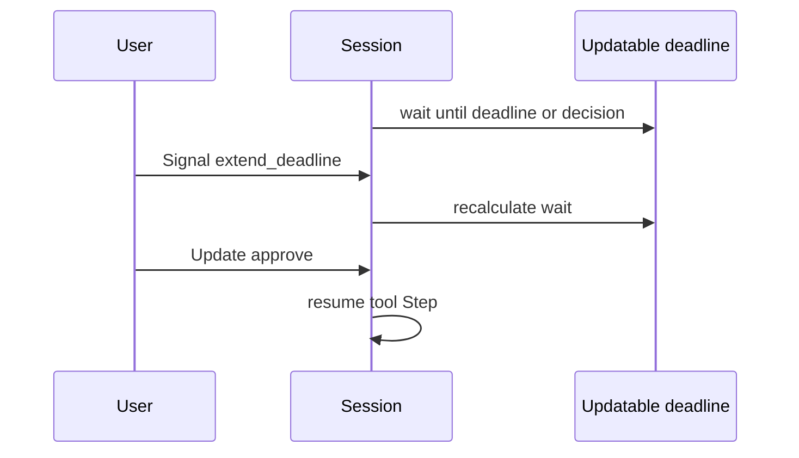

<h1>Updatable Approval Timer </h1>

## Overview

The Updatable Approval Timer pattern waits for human approval (or correction) with a deadline that Signals or Updates can extend, shorten, or cancel—without restarting the Session or losing Turn state.
Primitives used: `workflow.wait_condition` with timeout, Approval-Gated Tools, Session-Scoped Approvals, Resumable Correction, Operator Slash Commands.

## Problem

Approval and correction waits need SLAs: escalate or auto-deny after N minutes.
Operators often need more time ("extend 1h") or resolve early ("approve now").
A fixed `asyncio.timeout` / single timer cannot move; cancelling the Workflow to change the deadline destroys in-flight agent context.

## Solution

Park the Turn on `wait_condition` for approval/correction **or** deadline update, with a timeout equal to remaining time until the current deadline.
When a Signal/Update changes the deadline, loop and wait again with the new remaining duration.
When the deadline elapses with no decision, run your policy: deny, escalate, or [Resumable Correction](/resumable-correction) path.



The following describes each step in the diagram:

1. The Turn enters an approval wait with an initial deadline.
2. An operator extends the deadline; the wait recalculates without leaving the Session.
3. An approve Update unblocks the condition before the timer fires.
4. If the timer fires first, the Session applies timeout policy (deny / escalate).

```python
import asyncio
from datetime import timedelta

from temporalio import workflow

class ApprovalWait:
    def __init__(self, deadline: float) -> None:
        self.deadline = deadline
        self.decision: str | None = None
        self._deadline_updated = False

    def approve(self) -> None:
        self.decision = "approve"

    def extend(self, new_deadline: float) -> None:
        self.deadline = new_deadline
        self._deadline_updated = True

    async def wait(self) -> str:
        while self.decision is None:
            self._deadline_updated = False
            remaining = self.deadline - workflow.time()
            try:
                await workflow.wait_condition(
                    lambda: self.decision is not None or self._deadline_updated,
                    timeout=timedelta(seconds=max(remaining, 0)),
                )
            except asyncio.TimeoutError:
                return "timeout"
        return self.decision
```

Wire `approve` / `extend` to Updates or Signals; call `wait()` inside the Turn before the gated tool Activity.

## Implementation

<DaytonaRunner pattern="updatable-approval-timer" />


### Policies on timeout

| Policy | Use |
| :--- | :--- |
| Auto-deny | Risky tools; fail the Step |
| Escalate | Page on-call; start a new longer deadline |
| Park indefinitely | Only for low-risk internal agents |

Emit `approval_timeout` / `approval_extended` events for audit.

### Session-scoped grants

Combining with [Session-Scoped Approvals](/session-scoped-approvals): a session grant can clear the wait immediately; the timer only applies while still gated.

### Slash commands

Map `/extend 30m` and `/approve` to the same handlers ([Operator Slash Commands](/operator-slash-commands)).

### Continue-As-New

Carry `deadline` and pending approval ids across Continue-As-New so waits survive history reset.

## When to use

Use for approval and correction waits that have SLAs and need human-driven deadline changes.
Prefer a fixed timeout when policy is "N minutes then always deny" with no extensions.
Prefer infinite park only when an operator will always return and cost of waiting is zero.

## Benefits and trade-offs

You get durable, adjustable HITL deadlines without restarting Sessions.
You must define timeout policy and authorize who can extend.

## Comparison with alternatives

| Approach | Extendable | Durable |
| :--- | :--- | :--- |
| Updatable Approval Timer | Yes | Yes |
| Fixed Activity/Workflow timeout | No | Yes |
| Client-side setTimeout | Fragile | No |
| Restart Session with new deadline | Painful | Loses context |

## Best practices

- **Authorize extend and approve separately.** Extending is softer than approving.
- **Cap maximum total wait** even if operators keep extending.
- **Surface remaining time** on Progress Streaming / Queries for the UI.
- **Document timezone-free deadlines** using Workflow time (`workflow.time()`).

## Common pitfalls

- **Using wall-clock in the Worker without Workflow time.** Replay breaks.
- **Unlimited extensions** that never escalate.
- **Timing out without emitting an event.** Ops cannot tell deny-from-timeout vs user deny.
- **Forgetting to wake wait_condition** when updating the deadline flag.

## Related patterns

- [Approval-Gated Tools](/approval-gated-tools)
- [Session-Scoped Approvals](/session-scoped-approvals)
- [Resumable Correction](/resumable-correction)
- [Operator Slash Commands](/operator-slash-commands)
- [Progress Streaming](/progress-streaming)
- [Turn Workflow](/turn-workflow)

## Sample code

- [`sandbox-runner/patterns/updatable-approval-timer/python/`](https://github.com/temporal-sa/temporal-agentic-patterns/tree/main/sandbox-runner/patterns/updatable-approval-timer/python)

## References

- [Temporal Docs: Signals / Updates / wait conditions](https://docs.temporal.io/encyclopedia/workflow-message-passing)
- [Temporal Docs: Workflow time](https://docs.temporal.io/workflows#determinism)
