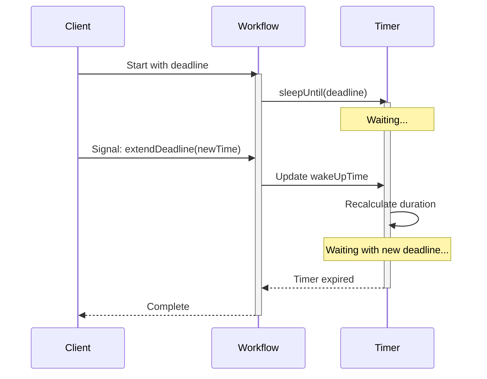

# Updatable / Debounced Timer Pattern

## Overview

The Updatable / Debounced Timer pattern implements a sleep operation that can be interrupted and dynamically adjusted via Signals.
It enables Workflows to wait for deadlines that can be extended or shortened based on external events, making it suitable for approval processes, SLA management, and time-sensitive business operations.

## Problem

In business processes, you often need Workflows that wait for a deadline (approval timeout, SLA expiration, grace period), allow the deadline to be extended or shortened dynamically, react immediately when the deadline changes, and continue waiting with the new deadline without restarting.

Without an updatable timer, you must use fixed timeouts that cannot be adjusted, cancel and restart Workflows to change deadlines, poll frequently to check for deadline changes, or implement complex state machines to handle timing updates.

## Solution

The Updatable / Debounced Timer uses `Workflow.await()` with a time condition that can be modified via Signals.
When a Signal updates the wake-up time, the await condition becomes true, the Workflow recalculates the sleep duration, and blocks again with the new deadline.



The following describes each step in the diagram:

1. The client starts the Workflow with an initial deadline.
2. The Workflow calls `sleepUntil(deadline)`, which blocks until the deadline.
3. The client sends a Signal to extend the deadline.
4. The timer recalculates the remaining duration based on the new deadline and continues waiting.
5. When the timer expires, the Workflow completes.

The core of the pattern is the `UpdatableTimer` helper class.
It loops on `Workflow.await()`, recalculating the sleep duration each time the wake-up time is updated:

```java
// UpdatableTimer.java
public class UpdatableTimer {
  private long wakeUpTime;
  private boolean wakeUpTimeUpdated;

  public void sleepUntil(long wakeUpTime) {
    this.wakeUpTime = wakeUpTime;
    while (true) {
      wakeUpTimeUpdated = false;
      Duration sleepInterval = Duration.ofMillis(this.wakeUpTime - Workflow.currentTimeMillis());
      if (!Workflow.await(sleepInterval, () -> wakeUpTimeUpdated)) {
        break; // Timer expired
      }
      // Timer was updated, loop to recalculate
    }
  }

  public void updateWakeUpTime(long wakeUpTime) {
    this.wakeUpTime = wakeUpTime;
    this.wakeUpTimeUpdated = true; // Unblocks await
  }
}
```

The `sleepUntil` method calculates the sleep interval and calls `Workflow.await()` with both a duration and a condition.
If the duration expires first, `Workflow.await()` returns `false` and the timer completes.
If the `wakeUpTimeUpdated` flag is set (via `updateWakeUpTime`), the condition becomes true, `Workflow.await()` returns `true`, and the loop recalculates the interval with the new deadline.

## Implementation

### Basic approval Workflow

The following implementation combines the updatable timer with an approval flag.
The Workflow waits for either an approval Signal or the deadline to expire:

```java
// ApprovalWorkflowImpl.java
@WorkflowInterface
public interface ApprovalWorkflow {
  @WorkflowMethod
  void execute(long approvalDeadline);
  
  @SignalMethod
  void extendDeadline(long newDeadline);
  
  @SignalMethod
  void approve();
  
  @QueryMethod
  String getStatus();
}

public class ApprovalWorkflowImpl implements ApprovalWorkflow {
  private UpdatableTimer timer = new UpdatableTimer();
  private boolean approved = false;
  private String status = "PENDING";
  
  @Override
  public void execute(long approvalDeadline) {
    Workflow.await(
        Duration.ofMillis(approvalDeadline - Workflow.currentTimeMillis()),
        () -> approved);
    
    if (approved) {
      status = "APPROVED";
    } else {
      status = "REJECTED";
    }
  }
  
  @Override
  public void extendDeadline(long newDeadline) {
    timer.updateWakeUpTime(newDeadline);
  }
  
  @Override
  public void approve() {
    approved = true;
  }
  
  @Override
  public String getStatus() {
    return status;
  }
}
```

The `execute` method calls `Workflow.await()` with the deadline duration and a condition that checks the `approved` flag.
If the `approve` Signal arrives before the deadline, the condition becomes true and the Workflow sets the status to APPROVED.
If the deadline expires first, the Workflow sets the status to REJECTED.

### Multiple deadline extensions

The following implementation uses the `UpdatableTimer` directly to support multiple deadline extensions.
The Workflow blocks on `timer.sleepUntil()` and checks the approval flag after the timer completes:

```java
// MultiExtensionApprovalWorkflowImpl.java
public class MultiExtensionApprovalWorkflowImpl implements ApprovalWorkflow {
  private UpdatableTimer timer = new UpdatableTimer();
  private boolean approved = false;
  private boolean rejected = false;
  
  @Override
  public void execute(long initialDeadline) {
    timer.sleepUntil(initialDeadline);
    
    if (!approved) {
      rejected = true;
    }
  }
  
  @Override
  public void extendDeadline(long newDeadline) {
    if (!approved && !rejected) {
      timer.updateWakeUpTime(newDeadline);
    }
  }
  
  @Override
  public void approve() {
    approved = true;
  }
}
```

The `extendDeadline` Signal handler checks that the Workflow has not already been approved or rejected before updating the timer.
Each call to `updateWakeUpTime` unblocks the `sleepUntil` loop, which recalculates the remaining duration and blocks again.

## When to use

The Updatable Timer pattern is a good fit for approval Workflows with deadline extensions, SLA management with grace periods, time-based escalations that can be postponed, auction bidding with extended closing times, and payment grace periods that can be adjusted.

It is not a good fit for fixed timeouts that never change (use `Workflow.sleep()`), immediate cancellation (use cancellation scopes), or complex scheduling (use Temporal Schedules).

## Benefits and trade-offs

The pattern allows you to adjust deadlines without restarting Workflows.
Changes take effect instantly.
The `UpdatableTimer` class is reusable across multiple Workflows.
All timing is based on Workflow time, ensuring replay consistency.
You can Query the current deadline at any time.

The trade-offs to consider are that the pattern requires an external process to send update Signals.
Each `UpdatableTimer` instance manages one deadline.
Previous deadlines are not tracked (add tracking if needed).
You must calculate absolute timestamps rather than relative durations.

## Comparison with alternatives

| Approach | Dynamic updates | Complexity | Use case |
| :--- | :--- | :--- | :--- |
| Updatable / Debounced Timer | Yes | Medium | Adjustable deadlines |
| Workflow.sleep() | No | Low | Fixed delays |
| Cancellation Scope | Yes (cancel only) | Medium | Abort operations |
| Polling Loop | Yes | High | Frequent checks |

## Best practices

- **Use absolute timestamps.** Store wake-up time as epoch millis, not relative durations.
- **Validate updates.** Ensure new deadlines are in the future.
- **Add Queries.** Expose the current deadline via Query methods.
- **Handle edge cases.** Check if the timer already expired before updating.
- **Consider max extensions.** Limit how many times or how far deadlines can be extended.
- **Log changes.** Log each deadline update for observability.
- **Reuse UpdatableTimer.** Extract to a helper class for use across Workflows.
- **Combine with conditions.** Use `Workflow.await()` with both time and business conditions.

## Common pitfalls

- **Using time-based conditions in `Workflow.await` without a duration.** `Workflow.await(() -> someTimeCondition)` does not create a timer. The condition is only re-evaluated on state changes (Signals, Activity completions). Always use `Workflow.await(Duration, condition)` for time-based waits.
- **Expecting `Workflow.await` to re-evaluate its duration.** The timer duration is set once when `Workflow.await` is called. Changing the duration variable afterward has no effect. This is why the `UpdatableTimer` loops and recalculates.
- **Not validating new deadlines.** Accepting a deadline in the past causes the timer to expire immediately. Always check that the new deadline is in the future before updating.
- **Accumulating uncancelled timers in Java.** In the Java SDK, `Workflow.await(Duration, condition)` does not automatically cancel its internal timer when the condition is met. Repeated calls in a loop accumulate timers. Wrap in a `CancellationScope` if this is a concern.

## Related patterns

- **[Signal with Start](signal-with-start.md)**: Receiving external events to modify behavior.
- **[Approval Pattern](approval.md)**: Approval Workflows with adjustable deadlines.

## Sample code

- [Full Java Sample](https://github.com/temporalio/samples-java/tree/main/core/src/main/java/io/temporal/samples/updatabletimer) — Complete implementation with starter and updater.
