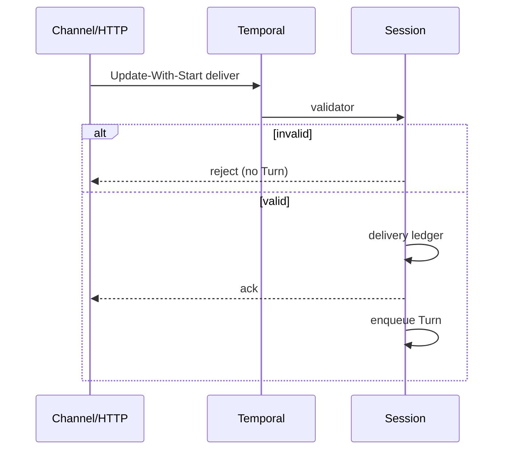

<h1>Validated Session Ingress </h1>

## Overview

The Validated Session Ingress pattern accepts channel/HTTP deliveries through Workflow Updates with validators so bad payloads are rejected before they enqueue Turns or enter history as accepted work—then pairs with Idempotent Delivery for safe retries.
Primitives used: Update validators, Update-With-Start, Idempotent Delivery ledger, Typed Agent Operations style contracts, HTTP Channel Agent.

## Problem

If the API writes straight into Signals with unchecked bodies, poison JSON and authz bugs become Session history.
Validators in the HTTP tier alone can drift from Workflow rules; duplicates still need a durable ledger.

## Solution

1. Expose `deliver` (or equivalent) as a Workflow Update with a **validator** for schema, size, tenant, and auth context.
2. Use Update-With-Start so create-or-attach returns a typed ack.
3. Apply [Idempotent Delivery](/idempotent-delivery) inside the accepted Update handler.
4. Only after validation + ledger accept does a Turn enqueue.



The following describes each step in the diagram:

1. The channel sends a delivery Update (with start-if-needed).
2. The validator rejects bad shape/auth before accept.
3. The handler dedupes by `delivery_id` and enqueues at most one Turn.
4. Retries replay the same ack without new work.

```python
from dataclasses import dataclass
from temporalio import workflow

@dataclass
class Delivery:
    delivery_id: str
    text: str

@workflow.defn
class AgentSessionWorkflow:
    @workflow.update
    async def deliver(self, d: Delivery) -> str:
        # ledger + enqueue ...
        return "accepted"

    @deliver.validator
    def validate_deliver(self, d: Delivery) -> None:
        if not d.delivery_id or not d.text.strip():
            raise ValueError("delivery_id and text required")
        if len(d.text) > 8000:
            raise ValueError("text too large")
```

## Implementation

<DaytonaRunner pattern="validated-session-ingress" />

### Validator vs handler

Validators must be deterministic and side-effect free—no Activities.
Heavy checks (DLP) belong in [Guardrail Steps](/guardrail-steps) after accept, or in the API before Update when you accept that API policy can drift.

### AuthN/Z

Pass verified tenant/actor from the API into Update args; validator enforces they match Session ownership.
Do not trust client-only tenant fields.

### With eager start

[Eager Interactive Session Start](/eager-interactive-session-start) can accelerate first Task after a valid start; validation still runs first.

## When to use

Use for every production HTTP/messaging ingress.
Skip only for trusted internal stubs.

## Benefits and trade-offs

You keep poison payloads out of accepted Turn queues and get typed acks.
You must keep API and validator rules aligned for UX error messages.

## Comparison with alternatives

| Approach | Reject before history work | Durable dedupe |
| :--- | :--- | :--- |
| Validated Session Ingress | Yes (validator) | With delivery ledger |
| Signal only | Weak | Hard |
| API validation only | Partial | Needs ledger anyway |
| Guardrail after enqueue | Late | Yes |

## Best practices

- **Update-With-Start + validator + delivery_id.**
- **Bound payload size** in the validator.
- **Return stable error types** to channels.
- **Authorize actor/tenant** on every delivery.

## Common pitfalls

- **Activities inside validators.**
- **Accepting then validating in a child Turn**—waste and history noise.
- **New delivery_id on every HTTP retry.**
- **Skipping validators on operator Signals.**

## Related patterns

- [Idempotent Delivery](/idempotent-delivery)
- [Session with Signal-and-Start](/session-signal-and-start)
- [Typed Agent Operations](/typed-agent-operations)
- [HTTP Channel Agent](/http-channel-agent)
- [Guardrail Steps](/guardrail-steps)
- [Eager Interactive Session Start](/eager-interactive-session-start)

## Sample code

- [`sandbox-runner/patterns/validated-session-ingress/python/`](https://github.com/temporal-sa/temporal-agentic-patterns/tree/main/sandbox-runner/patterns/validated-session-ingress/python)

## References

- [Temporal Docs: Update validators](https://docs.temporal.io/handling-messages#update-validators)
- [Temporal Docs: Update-With-Start](https://docs.temporal.io/sending-messages#update-with-start)
