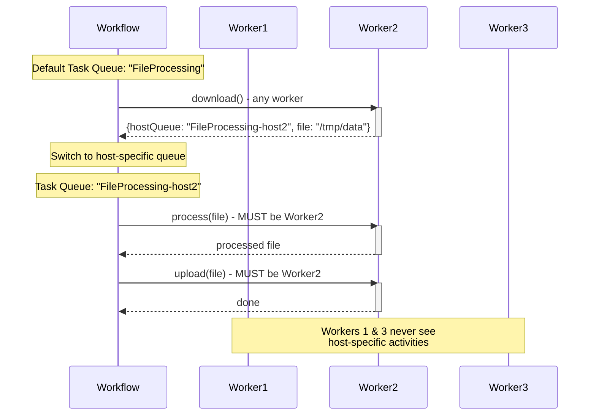

# Worker-Specific Task Queues Pattern

## Overview

The Worker-Specific Task Queues pattern enables routing activities to specific worker hosts when activities must execute on the same machine. This is essential for workflows where subsequent activities depend on local state, files, or resources created by previous activities on a particular host.

## Problem

In distributed systems, you often need workflows that:
- Download a file to a worker's local disk, then process and upload it from the same location
- Establish a connection or session that subsequent activities must reuse
- Create temporary resources on one host that later activities need to access
- Maintain affinity to a specific worker for performance or data locality

Without worker-specific routing, you face:
- Activities executing on different hosts, unable to access local files or state
- Complex distributed file systems or shared storage requirements
- Race conditions when multiple workers access the same resources
- Inability to guarantee activity colocation

## Solution

Use a two-tier task queue architecture: a default shared task queue for initial activities, and dynamically-named host-specific task queues for activities that must run on the same worker. The first activity returns its host-specific task queue name, and subsequent activities use that queue.



```java
// First activity uses default task queue and returns host-specific queue
TaskQueueFileNamePair downloaded = defaultTaskQueueActivities.download(source);

// Create activity stub with host-specific task queue
ActivityOptions hostOptions = ActivityOptions.newBuilder()
    .setTaskQueue(downloaded.getHostTaskQueue())
    .setScheduleToStartTimeout(Duration.ofSeconds(10))
    .setStartToCloseTimeout(Duration.ofSeconds(20))
    .build();
StoreActivities hostSpecificActivities = 
    Workflow.newActivityStub(StoreActivities.class, hostOptions);

// These activities execute on the same host as download
String processed = hostSpecificActivities.process(downloaded.getFileName());
hostSpecificActivities.upload(processed, destination);
```

## Implementation

### Activity Interface with Host-Specific Return

```java
public interface StoreActivities {
  
  class TaskQueueFileNamePair {
    private final String hostTaskQueue;
    private final String fileName;
    
    public TaskQueueFileNamePair(String hostTaskQueue, String fileName) {
      this.hostTaskQueue = hostTaskQueue;
      this.fileName = fileName;
    }
    
    public String getHostTaskQueue() { return hostTaskQueue; }
    public String getFileName() { return fileName; }
  }
  
  // Returns both the file path and the host-specific task queue
  TaskQueueFileNamePair download(URL source);
  
  // Must run on same host as download
  String process(String fileName);
  
  // Must run on same host as process
  void upload(String fileName, URL destination);
}
```

### Activity Implementation

```java
public class StoreActivitiesImpl implements StoreActivities {
  private final String hostSpecificTaskQueue;
  
  public StoreActivitiesImpl(String hostSpecificTaskQueue) {
    this.hostSpecificTaskQueue = hostSpecificTaskQueue;
  }
  
  @Override
  public TaskQueueFileNamePair download(URL source) {
    File localFile = downloadToLocalDisk(source);
    // Return both the local file path and this worker's task queue
    return new TaskQueueFileNamePair(
        hostSpecificTaskQueue, 
        localFile.getAbsolutePath());
  }
  
  @Override
  public String process(String fileName) {
    // Process the local file (already on this host)
    File processed = processLocalFile(new File(fileName));
    return processed.getAbsolutePath();
  }
  
  @Override
  public void upload(String fileName, URL destination) {
    // Upload the local file (already on this host)
    uploadFromLocalDisk(new File(fileName), destination);
  }
}
```

### Workflow Implementation

```java
public class FileProcessingWorkflowImpl implements FileProcessingWorkflow {
  private final StoreActivities defaultTaskQueueActivities;
  
  public FileProcessingWorkflowImpl() {
    ActivityOptions defaultOptions = ActivityOptions.newBuilder()
        .setStartToCloseTimeout(Duration.ofSeconds(20))
        .build();
    this.defaultTaskQueueActivities = 
        Workflow.newActivityStub(StoreActivities.class, defaultOptions);
  }
  
  @Override
  public void processFile(URL source, URL destination) {
    // Step 1: Download on any available worker
    TaskQueueFileNamePair downloaded = 
        defaultTaskQueueActivities.download(source);
    
    // Step 2: Create stub for host-specific activities
    ActivityOptions hostOptions = ActivityOptions.newBuilder()
        .setTaskQueue(downloaded.getHostTaskQueue())
        .setScheduleToStartTimeout(Duration.ofSeconds(10))
        .setStartToCloseTimeout(Duration.ofSeconds(20))
        .build();
    StoreActivities hostSpecificActivities = 
        Workflow.newActivityStub(StoreActivities.class, hostOptions);
    
    // Step 3: Process and upload on the same host
    String processed = hostSpecificActivities.process(downloaded.getFileName());
    hostSpecificActivities.upload(processed, destination);
  }
}
```

### Worker Setup

```java
public class FileProcessingWorker {
  public static void main(String[] args) {
    WorkflowClient client = WorkflowClient.newInstance(service);
    
    String defaultTaskQueue = "FileProcessing";
    String hostTaskQueue = "FileProcessing-" + getHostName();
    
    WorkerFactory factory = WorkerFactory.newInstance(client);
    
    // Worker for default task queue (workflows + initial activities)
    Worker defaultWorker = factory.newWorker(defaultTaskQueue);
    defaultWorker.registerWorkflowImplementationTypes(
        FileProcessingWorkflowImpl.class);
    defaultWorker.registerActivitiesImplementations(
        new StoreActivitiesImpl(hostTaskQueue));
    
    // Worker for host-specific task queue (subsequent activities)
    Worker hostWorker = factory.newWorker(hostTaskQueue);
    hostWorker.registerActivitiesImplementations(
        new StoreActivitiesImpl(hostTaskQueue));
    
    factory.start();
  }
}
```

## Key Components

1. **Default Task Queue**: Shared queue where workflows and initial activities execute
2. **Host-Specific Task Queue**: Per-worker queue (e.g., "FileProcessing-host1") for affinity-required activities
3. **Return Value with Queue Name**: First activity returns both data and its task queue name
4. **Dynamic Activity Stub**: Workflow creates new stub with host-specific task queue
5. **ScheduleToStartTimeout**: Critical timeout for host-specific queues to handle worker failures

## When to Use

**Ideal for:**
- File processing workflows (download, process, upload on same host)
- Database connection pooling (maintain connection across activities)
- GPU-bound operations (route to workers with specific hardware)
- Session-based external API calls
- Temporary resource management (cache, temp files, locks)

**Not ideal for:**
- Stateless activities that can run anywhere
- Activities that use shared storage (S3, databases)
- High-availability requirements (host failure blocks workflow)
- Simple workflows without local state dependencies

## Benefits

- **Resource Locality**: Activities access local files/state without network overhead
- **Simplified Logic**: No need for distributed file systems or state management
- **Performance**: Eliminates data transfer between workers
- **Flexibility**: First activity can run on any worker; only subsequent ones are pinned
- **Deterministic**: Task queue routing is recorded in workflow history

## Trade-offs

- **Single Point of Failure**: If the specific worker crashes, activities can't proceed until timeout
- **Load Imbalance**: Host-specific queues may have uneven distribution
- **Complexity**: Requires managing multiple task queues per worker
- **ScheduleToStartTimeout Required**: Must set timeout to handle worker unavailability
- **Resource Cleanup**: Need to handle cleanup if workflow fails mid-process

## How It Works

1. Workflow starts on default task queue
2. First activity executes on any available worker
3. Activity returns result + its host-specific task queue name
4. Workflow creates new activity stub with that task queue
5. Subsequent activities are routed to the specific worker
6. If worker is unavailable, ScheduleToStartTimeout triggers retry logic

## Comparison with Alternatives

| Approach | Locality | Complexity | Availability |
|----------|----------|------------|--------------|
| Worker-Specific Queues | Guaranteed | Medium | Lower |
| Shared Storage (S3) | None | Low | Higher |
| Sticky Execution | Best effort | Low | Higher |
| Session Framework | Guaranteed | High | Lower |

## Related Patterns

- **Activity Retry Policies**: Handling failures when specific worker is unavailable
- **Workflow Retry**: Retrying entire sequence on different host if needed
- **Cancellation Scopes**: Cleaning up resources when workflow is cancelled
- **Local Activities**: For very short operations that benefit from colocation

## Sample Code

- [Full Java Sample](https://github.com/temporalio/samples-java/tree/main/core/src/main/java/io/temporal/samples/fileprocessing) - Complete file processing implementation

## Best Practices

1. **Set ScheduleToStartTimeout**: Always configure this for host-specific queues to handle worker failures
2. **Implement Cleanup**: Use try-finally or cancellation scopes to clean up local resources
3. **Unique Queue Names**: Use hostname, IP, or UUID to ensure unique task queue names
4. **Monitor Queue Depth**: Alert on growing host-specific queue backlogs
5. **Graceful Shutdown**: Drain host-specific queues before stopping workers
6. **Retry Entire Sequence**: Wrap the sequence in Workflow.retry() to restart on different host if needed
7. **Resource Limits**: Limit concurrent workflows per worker to prevent resource exhaustion
8. **Health Checks**: Verify worker health before accepting work on host-specific queues
