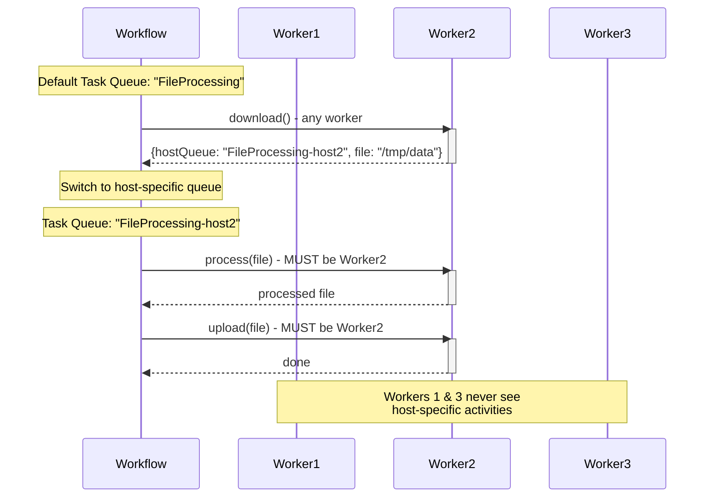

# Worker-Specific Task Queues Pattern

## Overview

The Worker-Specific Task Queues pattern enables routing Activities to specific Worker hosts when Activities must execute on the same machine.
This is essential for Workflows where subsequent Activities depend on local state, files, or resources created by previous Activities on a particular host.

## Problem

In distributed systems, you often need Workflows that download a file to a Worker's local disk and then process and upload it from the same location, establish a connection or session that subsequent Activities must reuse, create temporary resources on one host that later Activities need to access, or maintain affinity to a specific Worker for performance or data locality.

Without Worker-specific routing, Activities execute on different hosts and cannot access local files or state.
You must set up complex distributed file systems or shared storage, handle race conditions when multiple Workers access the same resources, and accept that you cannot guarantee Activity colocation.

## Solution

You use a two-tier Task Queue architecture: a default shared Task Queue for initial Activities, and dynamically-named host-specific Task Queues for Activities that must run on the same Worker.
The first Activity returns its host-specific Task Queue name, and subsequent Activities use that queue.


```mermaid
sequenceDiagram
    participant Workflow
    participant Worker1
    participant Worker2
    participant Worker3

    Note over Workflow: Default Task Queue: "FileProcessing"
    Workflow->>Worker2: download() - any worker
    activate Worker2
    Worker2-->>Workflow: {hostQueue: "FileProcessing-host2", file: "/tmp/data"}
    deactivate Worker2
    
    Note over Workflow: Switch to host-specific queue
    Note over Workflow: Task Queue: "FileProcessing-host2"
    
    Workflow->>Worker2: process(file) - MUST be Worker2
    activate Worker2
    Worker2-->>Workflow: processed file
    deactivate Worker2
    
    Workflow->>Worker2: upload(file) - MUST be Worker2
    activate Worker2
    Worker2-->>Workflow: done
    deactivate Worker2
    
    Note over Worker1,Worker3: Workers 1 & 3 never see<br/>host-specific activities
```

The following describes each step in the diagram:

1. The Workflow dispatches the download Activity on the default Task Queue. Any available Worker picks it up.
2. Worker 2 downloads the file and returns both the local file path and its host-specific Task Queue name.
3. The Workflow creates a new Activity stub targeting Worker 2's host-specific Task Queue.
4. The process and upload Activities execute on Worker 2, where the file is already on disk.
5. Workers 1 and 3 never see the host-specific Activities.

The following snippet shows how the Workflow switches from the default Task Queue to the host-specific queue:

```java
// FileProcessingWorkflowImpl.java
TaskQueueFileNamePair downloaded = defaultTaskQueueActivities.download(source);

ActivityOptions hostOptions = ActivityOptions.newBuilder()
    .setTaskQueue(downloaded.getHostTaskQueue())
    .setScheduleToStartTimeout(Duration.ofSeconds(10))
    .setStartToCloseTimeout(Duration.ofSeconds(20))
    .build();
StoreActivities hostSpecificActivities = 
    Workflow.newActivityStub(StoreActivities.class, hostOptions);

String processed = hostSpecificActivities.process(downloaded.getFileName());
hostSpecificActivities.upload(processed, destination);
```

The `setTaskQueue()` call routes subsequent Activities to the specific Worker that downloaded the file.
The `setScheduleToStartTimeout()` is critical — if the specific Worker is unavailable, this timeout triggers retry logic rather than waiting indefinitely.

## Implementation

### Activity interface with host-specific return

The download Activity returns both the file path and the host-specific Task Queue name:

```java
// StoreActivities.java
public interface StoreActivities {
  
  class TaskQueueFileNamePair {
    private final String hostTaskQueue;
    private final String fileName;
    
    public TaskQueueFileNamePair(String hostTaskQueue, String fileName) {
      this.hostTaskQueue = hostTaskQueue;
      this.fileName = fileName;
    }
    
    public String getHostTaskQueue() { return hostTaskQueue; }
    public String getFileName() { return fileName; }
  }
  
  TaskQueueFileNamePair download(URL source);
  String process(String fileName);
  void upload(String fileName, URL destination);
}
```

The `TaskQueueFileNamePair` bundles the local file path with the Task Queue name so the Workflow knows where to route subsequent Activities.

### Activity implementation

The Activity implementation receives the host-specific Task Queue name at construction time and includes it in the download result:

```java
// StoreActivitiesImpl.java
public class StoreActivitiesImpl implements StoreActivities {
  private final String hostSpecificTaskQueue;
  
  public StoreActivitiesImpl(String hostSpecificTaskQueue) {
    this.hostSpecificTaskQueue = hostSpecificTaskQueue;
  }
  
  @Override
  public TaskQueueFileNamePair download(URL source) {
    File localFile = downloadToLocalDisk(source);
    return new TaskQueueFileNamePair(
        hostSpecificTaskQueue, 
        localFile.getAbsolutePath());
  }
  
  @Override
  public String process(String fileName) {
    File processed = processLocalFile(new File(fileName));
    return processed.getAbsolutePath();
  }
  
  @Override
  public void upload(String fileName, URL destination) {
    uploadFromLocalDisk(new File(fileName), destination);
  }
}
```

The `download` method returns the host-specific Task Queue name alongside the file path.
The `process` and `upload` methods operate on local files, which are guaranteed to exist because they run on the same host.

### Workflow implementation

The Workflow uses the default Task Queue for the initial download and switches to the host-specific queue for subsequent Activities:

```java
// FileProcessingWorkflowImpl.java
public class FileProcessingWorkflowImpl implements FileProcessingWorkflow {
  private final StoreActivities defaultTaskQueueActivities;
  
  public FileProcessingWorkflowImpl() {
    ActivityOptions defaultOptions = ActivityOptions.newBuilder()
        .setStartToCloseTimeout(Duration.ofSeconds(20))
        .build();
    this.defaultTaskQueueActivities = 
        Workflow.newActivityStub(StoreActivities.class, defaultOptions);
  }
  
  @Override
  public void processFile(URL source, URL destination) {
    TaskQueueFileNamePair downloaded = 
        defaultTaskQueueActivities.download(source);
    
    ActivityOptions hostOptions = ActivityOptions.newBuilder()
        .setTaskQueue(downloaded.getHostTaskQueue())
        .setScheduleToStartTimeout(Duration.ofSeconds(10))
        .setStartToCloseTimeout(Duration.ofSeconds(20))
        .build();
    StoreActivities hostSpecificActivities = 
        Workflow.newActivityStub(StoreActivities.class, hostOptions);
    
    String processed = hostSpecificActivities.process(downloaded.getFileName());
    hostSpecificActivities.upload(processed, destination);
  }
}
```

The Workflow creates two Activity stubs: one for the default Task Queue and one for the host-specific queue returned by the download Activity.

### Worker setup

Each Worker registers with both the default Task Queue and its own host-specific Task Queue:

```java
// FileProcessingWorker.java
public class FileProcessingWorker {
  public static void main(String[] args) {
    WorkflowClient client = WorkflowClient.newInstance(service);
    
    String defaultTaskQueue = "FileProcessing";
    String hostTaskQueue = "FileProcessing-" + getHostName();
    
    WorkerFactory factory = WorkerFactory.newInstance(client);
    
    Worker defaultWorker = factory.newWorker(defaultTaskQueue);
    defaultWorker.registerWorkflowImplementationTypes(
        FileProcessingWorkflowImpl.class);
    defaultWorker.registerActivitiesImplementations(
        new StoreActivitiesImpl(hostTaskQueue));
    
    Worker hostWorker = factory.newWorker(hostTaskQueue);
    hostWorker.registerActivitiesImplementations(
        new StoreActivitiesImpl(hostTaskQueue));
    
    factory.start();
  }
}
```

The default Worker handles Workflows and initial Activities.
The host-specific Worker handles only Activities that require Worker affinity.
Both Workers receive the same Activity implementation, but only the host-specific Worker receives Activities routed to its queue.

## When to use

The Worker-Specific Task Queues pattern is a good fit for file processing Workflows (download, process, upload on the same host), database connection pooling (maintain a connection across Activities), GPU-bound operations (route to Workers with specific hardware), session-based external API calls, and temporary resource management (cache, temp files, locks).

It is not a good fit for stateless Activities that can run anywhere, Activities that use shared storage (S3, databases), high-availability requirements (host failure blocks the Workflow), or Workflows without local state dependencies.

## Benefits and trade-offs

Activities access local files and state without network overhead.
You do not need distributed file systems or state management.
Data transfer between Workers is eliminated.
The first Activity can run on any Worker; only subsequent ones are pinned.
Task Queue routing is recorded in Workflow history, ensuring deterministic behavior.

The trade-offs to consider are that if the specific Worker crashes, Activities cannot proceed until the ScheduleToStartTimeout expires.
Host-specific queues may have uneven load distribution.
You must manage multiple Task Queues per Worker.
You must set ScheduleToStartTimeout to handle Worker unavailability.
You need to handle cleanup if the Workflow fails mid-process.

## Comparison with alternatives

| Approach | Locality | Complexity | Availability |
| :--- | :--- | :--- | :--- |
| Worker-Specific Queues | Guaranteed | Medium | Lower |
| Shared Storage (S3) | None | Low | Higher |
| Sticky Execution | Best effort | Low | Higher |
| Session Framework | Guaranteed | High | Lower |

## Best practices

- **Set ScheduleToStartTimeout.** Always configure this for host-specific queues to handle Worker failures.
- **Implement cleanup.** Use try-finally or cancellation scopes to clean up local resources.
- **Use unique queue names.** Use hostname, IP, or UUID to ensure unique Task Queue names.
- **Monitor queue depth.** Alert on growing host-specific queue backlogs.
- **Drain gracefully.** Drain host-specific queues before stopping Workers.
- **Retry the entire sequence.** Wrap the sequence in retry logic to restart on a different host if needed.
- **Limit concurrent Workflows.** Limit concurrent Workflows per Worker to prevent resource exhaustion.
- **Add health checks.** Verify Worker health before accepting work on host-specific queues.

## Common pitfalls

- **Missing ScheduleToStartTimeout on host-specific queues.** Without this timeout, if the target Worker is down, the Activity waits indefinitely. Always set `ScheduleToStartTimeout` so the Workflow can detect unavailability and retry on a different host.
- **Not registering the Worker on both queues.** Each Worker must listen on both the default shared Task Queue (for Workflows and initial Activities) and its own host-specific queue. Forgetting the host-specific queue means routed Activities are never picked up.
- **Assuming the host-specific Worker is always available.** The pinned Worker can crash or be restarted. Design the Workflow to retry the entire sequence on a different host when the `ScheduleToStartTimeout` expires.
- **Leaking temporary files on failure.** If the Workflow fails after downloading but before uploading, temporary files remain on disk. Use cleanup logic (defer, try-finally, or cancellation scopes) to remove local resources.
- **Using host-specific queues when shared storage suffices.** If all Workers can access the same storage (S3, NFS), Worker-specific routing adds unnecessary complexity and reduces availability.

## Related patterns

- **[Long-Running Activity](long-running-activity.md)**: For very short operations that benefit from colocation.

## Sample code

- [Full Java Sample](https://github.com/temporalio/samples-java/tree/main/core/src/main/java/io/temporal/samples/fileprocessing) — Complete file processing implementation.
