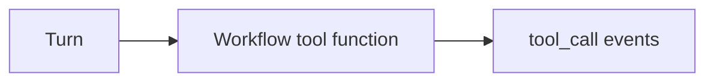

<h1>Workflow Tool </h1>

## Overview

The Workflow Tool pattern implements a pure, deterministic tool as in-Workflow code.
Use it for validation, cheap computation, or deterministic transforms that must replay exactly on Workflow re-execution.
Primitives used: ToolDefinition (`kind=workflow`), ToolCallStep without an Activity schedule.

## Problem

Not every tool needs an Activity.
If you schedule Activities for pure functions, you add latency and noise.
If you put non-deterministic logic in the Workflow, replay breaks.

## Solution

Keep pure tools as ordinary Python functions called from the Workflow.
Still emit tool events so the session stream stays complete.



The following describes each step in the diagram:

1. The Turn selects a Workflow tool.
2. The Workflow runs the function inline (no Activity task).
3. The Turn records tool events with the result or validation error.

```python
def validate_total(cents: int) -> str:
    if cents < 0:
        raise ValueError("negative total")
    return f"valid:{cents}"
```

## Implementation

<DaytonaRunner pattern="workflow-tool" />

### Choosing Workflow vs Activity tools

| Question | Prefer |
| :--- | :--- |
| Does it call the network or a DB? | Activity Tool |
| Is it pure and cheap? | Workflow Tool |
| Must humans approve it? | Usually Activity Tool (clearer parking) |

## When to use

Use Workflow Tools for deterministic validation and transforms.
Do not use them for model calls, HTTP, or filesystem IO.

## Benefits and trade-offs

You avoid Activity overhead and keep replay exact.
You manage the discipline of keeping those tools pure.

## Comparison with alternatives

| Approach | Overhead | Allowed IO |
| :--- | :--- | :--- |
| Workflow Tool | Low | None |
| Activity Tool | Higher | Yes |
| Local Activity | Medium | Yes, short |

## Best practices

- **No hidden IO.** Imports that touch the network belong in Activities.
- **Still emit events.** Observers should not special-case Workflow tools.
- **Keep results small.** Large pure outputs still bloat history.

## Common pitfalls

- **Calling `datetime.now()` or random inside a Workflow tool.** Breaks replay.
- **Using Workflow tools for "quick" HTTP.** Latency and failure modes still need Activities.
- **Heavy CPU inline in the Workflow.** Long pure computation still blocks the Workflow task; prefer an Activity for expensive work.

## Related patterns

- [Activity Tool](/activity-tool)
- [Type-Checked Scripts](/type-checked-scripts)

## Sample code

- [`sandbox-runner/patterns/workflow-tool/python/`](https://github.com/temporal-sa/temporal-agentic-patterns/tree/main/sandbox-runner/patterns/workflow-tool/python)

## References

- [Temporal Docs: Workflow determinism](https://docs.temporal.io/workflows#deterministic-constraints)
