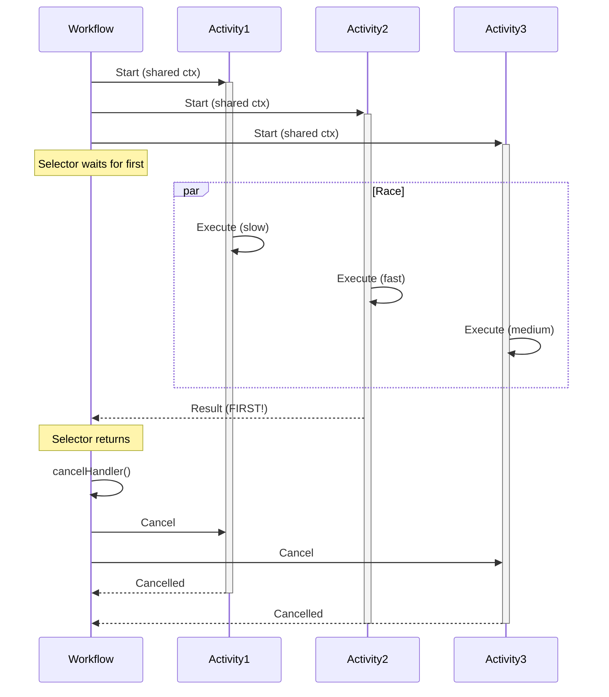

# Pick First Pattern

## Overview

The Pick First pattern executes multiple activities in parallel and returns the result of whichever completes first, then cancels the remaining activities. It's ideal for racing multiple approaches to the same task, implementing timeout alternatives, or optimizing for fastest response when multiple options are available.

## Problem

In distributed systems, you often need workflows that:
- Execute multiple activities that can accomplish the same goal
- Return as soon as any one succeeds (fastest wins)
- Cancel remaining activities to avoid wasted resources
- Handle scenarios where speed matters more than trying all options

Without pick first, you must:
- Wait for all activities to complete even when only one result is needed
- Manually track which activity finished first
- Implement complex cancellation logic for remaining activities
- Waste compute resources on activities whose results won't be used

## Solution

The Pick First pattern uses `workflow.NewSelector()` to wait for multiple futures simultaneously, captures the first result, then cancels remaining activities using a shared cancellation context.



```go
func PickFirstWorkflow(ctx workflow.Context) (string, error) {
  selector := workflow.NewSelector(ctx)
  var firstResponse string
  
  childCtx, cancelHandler := workflow.WithCancel(ctx)
  childCtx = workflow.WithActivityOptions(childCtx, activityOptions)
  
  f1 := workflow.ExecuteActivity(childCtx, Activity, "option1")
  f2 := workflow.ExecuteActivity(childCtx, Activity, "option2")
  
  selector.AddFuture(f1, func(f workflow.Future) {
    _ = f.Get(ctx, &firstResponse)
  }).AddFuture(f2, func(f workflow.Future) {
    _ = f.Get(ctx, &firstResponse)
  })
  
  selector.Select(ctx) // Blocks until first completes
  cancelHandler()      // Cancel remaining activities
  
  return firstResponse, nil
}
```

## Implementation

### Basic Pick First

```go
func SamplePickFirstWorkflow(ctx workflow.Context) (string, error) {
  selector := workflow.NewSelector(ctx)
  var firstResponse string
  
  childCtx, cancelHandler := workflow.WithCancel(ctx)
  ao := workflow.ActivityOptions{
    StartToCloseTimeout: 2 * time.Minute,
    HeartbeatTimeout:    10 * time.Second,
    WaitForCancellation: true,
  }
  childCtx = workflow.WithActivityOptions(childCtx, ao)
  
  f1 := workflow.ExecuteActivity(childCtx, SampleActivity, 0, 10*time.Second)
  f2 := workflow.ExecuteActivity(childCtx, SampleActivity, 1, 1*time.Second)
  
  selector.AddFuture(f1, func(f workflow.Future) {
    _ = f.Get(ctx, &firstResponse)
  }).AddFuture(f2, func(f workflow.Future) {
    _ = f.Get(ctx, &firstResponse)
  })
  
  selector.Select(ctx)
  cancelHandler()
  
  return firstResponse, nil
}
```

### Activity with Cancellation Support

```go
func SampleActivity(ctx context.Context, branchID int, duration time.Duration) (string, error) {
  logger := activity.GetLogger(ctx)
  elapsed := time.Nanosecond
  
  for elapsed < duration {
    time.Sleep(time.Second)
    elapsed += time.Second
    
    activity.RecordHeartbeat(ctx, "status-report")
    
    select {
    case <-ctx.Done():
      msg := fmt.Sprintf("Branch %d cancelled", branchID)
      logger.Info(msg)
      return msg, ctx.Err()
    default:
      // Continue working
    }
  }
  
  return fmt.Sprintf("Branch %d completed", branchID), nil
}
```

### Advanced: Wait for Cancellation Completion

```go
func PickFirstWithCleanup(ctx workflow.Context) (string, error) {
  selector := workflow.NewSelector(ctx)
  var firstResponse string
  
  childCtx, cancelHandler := workflow.WithCancel(ctx)
  childCtx = workflow.WithActivityOptions(childCtx, workflow.ActivityOptions{
    StartToCloseTimeout: 2 * time.Minute,
    WaitForCancellation: true, // Wait for cleanup
  })
  
  f1 := workflow.ExecuteActivity(childCtx, Activity, "branch1")
  f2 := workflow.ExecuteActivity(childCtx, Activity, "branch2")
  pendingFutures := []workflow.Future{f1, f2}
  
  selector.AddFuture(f1, func(f workflow.Future) {
    _ = f.Get(ctx, &firstResponse)
  }).AddFuture(f2, func(f workflow.Future) {
    _ = f.Get(ctx, &firstResponse)
  })
  
  selector.Select(ctx)
  cancelHandler()
  
  // Wait for all activities to finish cancellation
  for _, f := range pendingFutures {
    _ = f.Get(ctx, nil)
  }
  
  return firstResponse, nil
}
```

## Key Components

1. **workflow.NewSelector()**: Waits for multiple futures simultaneously
2. **workflow.WithCancel()**: Creates cancellable context for child activities
3. **AddFuture()**: Registers futures with callbacks that capture results
4. **Select()**: Blocks until first future completes
5. **cancelHandler()**: Cancels all activities using the shared context
6. **WaitForCancellation**: Controls whether to wait for cancelled activities to finish

## When to Use

**Ideal for:**
- Racing multiple data sources (primary vs backup)
- Trying multiple algorithms and picking fastest
- Implementing fallback strategies with timeout
- Optimizing for latency when multiple options exist
- Testing multiple service endpoints for fastest response

**Not ideal for:**
- Need results from all activities (use parallel execution)
- Activities have side effects that shouldn't be cancelled
- Order matters (use sequential execution)
- All activities must complete (use workflow.Go())

## Benefits

- **Optimized Latency**: Returns as soon as fastest option completes
- **Resource Efficient**: Cancels unnecessary work automatically
- **Flexible**: Works with any number of parallel activities
- **Deterministic**: Selector ensures replay consistency
- **Clean Cancellation**: Proper cleanup of cancelled activities

## Trade-offs

- **Wasted Work**: Cancelled activities may have done partial work
- **Heartbeat Required**: Activities need heartbeats to detect cancellation quickly
- **Cancellation Delay**: Activities don't cancel instantly (wait for heartbeat)
- **Complexity**: Requires proper cancellation handling in activities
- **No Result Aggregation**: Only first result is used, others discarded

## How It Works

1. Workflow creates cancellable context with `workflow.WithCancel()`
2. Multiple activities start in parallel using the shared context
3. Selector registers all futures with callbacks
4. `selector.Select()` blocks until first future completes
5. First completion triggers callback, capturing result
6. `cancelHandler()` cancels context, signaling all activities
7. Activities detect cancellation via heartbeat and `ctx.Done()`
8. Optionally wait for all activities to finish cleanup

## Comparison with Alternatives

| Approach | Returns First | Cancels Others | Complexity | Use Case |
|----------|---------------|----------------|------------|----------|
| Pick First | Yes | Yes | Medium | Race for fastest |
| workflow.Go() | No | No | Low | All must complete |
| Sequential | No | N/A | Low | Order matters |
| Split/Merge | No | No | Medium | Aggregate results |

## Related Patterns

- **Split/Merge**: Execute in parallel and combine all results
- **Branch**: Execute different activities based on conditions
- **Cancellation Scopes**: Fine-grained cancellation control
- **Selectors**: Wait for multiple conditions simultaneously

## Sample Code

- [Full Go Sample](https://github.com/temporalio/samples-go/tree/main/pickfirst) - Complete implementation with worker and starter

## Best Practices

1. **Use Heartbeats**: Activities must heartbeat to detect cancellation quickly
2. **Set WaitForCancellation**: Decide if workflow should wait for cleanup
3. **Handle ctx.Done()**: Activities must check context cancellation
4. **Shared Context**: Use single cancellable context for all activities
5. **Track Futures**: Keep reference to all futures if waiting for cleanup
6. **Timeout Activities**: Set appropriate StartToCloseTimeout
7. **Log Cancellations**: Log when activities are cancelled for observability
8. **Idempotent Activities**: Design activities to handle cancellation safely
