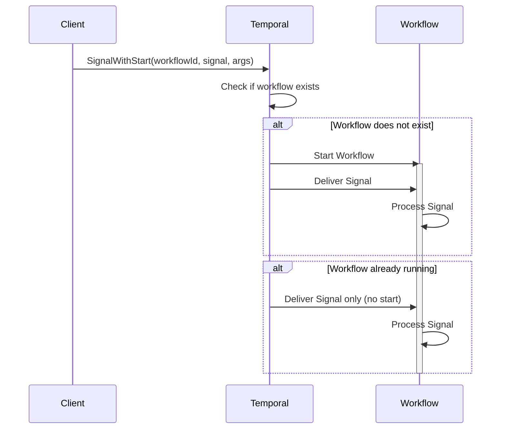

# Signal with Start Pattern

## Overview

Signal with Start is a pattern that lazily creates workflows when signaling them. If the workflow is already running, it receives the signal; if not, the workflow starts first and then receives the signal. This enables entity workflows that only exist when needed and can receive operations throughout their lifetime.

## Problem

In distributed systems, you often need workflows that:
- Represent long-lived entities (accounts, shopping carts, user sessions)
- Receive multiple operations over time
- Should only exist when there's work to do
- Need to handle the first operation without special client logic

Without Signal with Start, clients must:
- Check if the workflow exists before signaling
- Start the workflow if it doesn't exist, then signal it
- Handle race conditions when multiple clients try to start the same workflow
- Write complex coordination logic

## Solution

Temporal's Signal with Start API atomically starts a workflow (if not running) and delivers a signal in a single operation. The client doesn't need to know whether the workflow exists—the platform handles it automatically.



```java
BatchRequest request = workflowClient.newSignalWithStartRequest();
request.add(workflow::run);  // Workflow method to start
request.add(workflow::signal, args);  // Signal to deliver
workflowClient.signalWithStart(request);
```

## Implementation

### Basic Signal with Start

```java
public class ShoppingCartManager {
  public void addItem(String cartId, String itemId, String productId, int quantity) {
    WorkflowOptions options = WorkflowOptions.newBuilder()
        .setWorkflowId("cart-" + cartId)
        .setTaskQueue("carts")
        .build();
    
    ShoppingCartWorkflow workflow = 
        workflowClient.newWorkflowStub(ShoppingCartWorkflow.class, options);
    
    BatchRequest request = workflowClient.newSignalWithStartRequest();
    request.add(workflow::run);
    request.add(workflow::addItem, itemId, productId, quantity);
    workflowClient.signalWithStart(request);
  }
}

@WorkflowInterface
public interface ShoppingCartWorkflow {
  @WorkflowMethod
  void run();
  
  @SignalMethod
  void addItem(String itemId, String productId, int quantity);
}

public class ShoppingCartWorkflowImpl implements ShoppingCartWorkflow {
  private Set<String> processedItems = new HashSet<>();
  private List<CartItem> items = new ArrayList<>();
  
  @Override
  public void run() {
    Workflow.await(() -> false); // Run forever
  }
  
  @Override
  public void addItem(String itemId, String productId, int quantity) {
    if (!processedItems.add(itemId)) {
      return; // Duplicate signal
    }
    items.add(new CartItem(productId, quantity));
  }
}
```

### Signal with Start + WorkflowInit

Ensures proper initialization when signals arrive before the workflow method starts:

```java
public class GreetingManager {
  public void addGreeting(String workflowId, Person person) {
    WorkflowOptions options = WorkflowOptions.newBuilder()
        .setWorkflowId(workflowId)
        .setTaskQueue("greetings")
        .build();
    
    MyWorkflow workflow = 
        workflowClient.newWorkflowStub(MyWorkflow.class, options);
    
    WorkflowStub.fromTyped(workflow).signalWithStart(
        "addGreeting",
        new Object[] {person},  // Signal args
        new Object[] {person}); // Workflow method args
  }
}

public class MyWorkflowImpl implements MyWorkflow {
  private List<Person> peopleToGreet;
  
  @WorkflowInit
  public MyWorkflowImpl(Person person) {
    peopleToGreet = new ArrayList<>();  // Initialize before signal
  }
  
  @Override
  public String greet(Person person) {
    peopleToGreet.add(person);
    // Process greetings...
  }
  
  @Override
  public void addGreeting(Person person) {
    peopleToGreet.add(person);  // Safe: list initialized in @WorkflowInit
  }
}
```

## Key Components

1. **BatchRequest**: Container for workflow method and signal(s) to execute atomically
2. **Workflow ID**: Derived from business entity (account ID, user ID, session ID)
3. **Signal Handler**: Processes incoming operations with idempotency checks
4. **WorkflowInit**: Optional constructor for initialization before signals are delivered
5. **Long-Running Workflow**: Uses `Workflow.await()` or continues-as-new to stay alive

## When to Use

**Ideal for:**
- Entity workflows (accounts, shopping carts, user sessions, clusters)
- Workflows that receive multiple operations over their lifetime
- Lazy entity creation—only create when first operation arrives
- Fire-and-forget operations where immediate response isn't needed

**Not ideal for:**
- One-time operations (use REJECT_DUPLICATE policy instead)
- Request-response patterns requiring synchronous confirmation (use Update with Start)
- Operations that need immediate return values

## Benefits

- **Atomic Operation**: Start and signal happen atomically—no race conditions
- **Lazy Creation**: Workflows only exist when needed
- **Simplified Client**: No need to check if workflow exists
- **Idempotent**: Safe to retry—duplicate starts are handled by Workflow ID
- **Entity Pattern**: Natural fit for long-lived business entities

## Trade-offs

- **Fire-and-Forget**: No immediate confirmation that signal was processed
- **Signal Idempotency**: Still need to track processed operation IDs in workflow
- **Long-Running**: Workflows must handle unbounded execution (use continue-as-new)
- **No Return Value**: Signals don't return values (use queries or updates for that)

## Workflow ID Reuse Policies

Choose the appropriate policy for your use case:

- **ALLOW_DUPLICATE_FAILED_ONLY**: Recommended for entity workflows—allows restart if previous run failed
- **REJECT_DUPLICATE**: Prevents any duplicate starts - useful for one-time operations
- **ALLOW_DUPLICATE**: Allows new run regardless of previous runs—rarely used
- **TERMINATE_IF_RUNNING**: Terminates running workflow and starts new one—use with caution

## Comparison with Alternatives

| Approach | Use Case | Response Type | Idempotency |
|----------|----------|---------------|-------------|
| Signal with Start | Entity workflows | Fire-and-forget | Signal-level |
| Update with Start | Request-response | Sync return value | Update-level |
| REJECT_DUPLICATE | One-time operations | Async (Workflow ID) | Workflow-level |

## Related Patterns

- **Entity Workflow**: Long-running workflows representing business entities
- **Idempotent Operations**: Preventing duplicate processing
- **Continue-As-New**: Managing unbounded workflow history
- **Safe Message Passing**: Concurrent signal handling with locking

## Best Practices

1. **Derive Workflow ID from Entity**: Use stable business identifiers (account ID, user ID)
2. **Implement Signal Idempotency**: Track processed operation IDs to prevent duplicates
3. **Use WorkflowInit**: Initialize state before signals are delivered
4. **Handle Unbounded Execution**: Use continue-as-new for long-running entity workflows
5. **Choose Right Workflow ID Policy**: Use ALLOW_DUPLICATE_FAILED_ONLY for entity workflows
6. **Include Operation IDs**: Every signal should include a unique operation/reference ID
7. **Return Early**: Check for duplicates at the start of signal handlers
8. **Consider Queries**: Use queries to check workflow state after signaling
